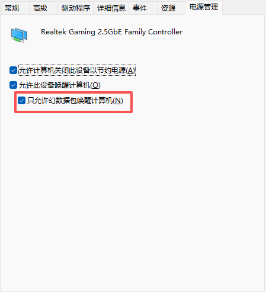

+++
title = '2025 09 15_21_45'
date = 2025-09-15T21:46:05+08:00
draft = false
+++

给电脑设置了通过网卡开机启动，然后使用```upsnap```来控制远程开机，结果发现电脑一休眠，不到1分钟就会被唤醒，查来查去，没找到原因，最后才发现，需要设置网卡```只允许幻数据包唤醒计算机```。猜测可能是upsnap会定时软检查计算机状态。

