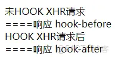
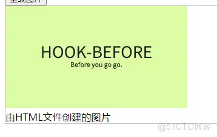
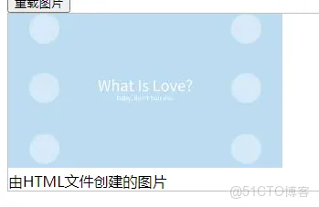
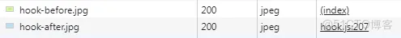
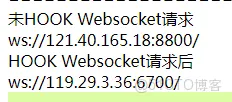

+++
title = '你以为你请求的就是你想请求的吗？'
date = 2021-11-04T00:00:00+08:00
draft = false
slug = "0001"
+++

在如今SPA应用流行的情况下，页面上的所有东西都是通过javascript进行加载，本文将带你一步一步截获用户请求，并修改请求地址。

我们主要使用的方法为Hook原生接口进行接口调用拦截；在拦截前，先定义一个URL修改的函数，统一将URL请求中的before修改为after，你在你的实际处理中可能会更加复杂。

```javascript
function srcHook(url) {
    let nUrl = url.replace("hook-before", "hook-after");
    return nUrl;
}
```
<!--more-->
# Ajax请求

在前端中，一般是通过Ajax向后台请求数据，所以首要需要拦截的就是Ajax的请求。

先来看一下如何发出一个Ajax请求：

```javascript
var xhr = new XMLHttpRequest();
xhr.timeout = 3000;
xhr.ontimeout = function (event) {
    alert("请求超时！");
}
xhr.open('GET', '/data/hook-before.txt');
xhr.send();
xhr.onreadystatechange = function () {
    if (xhr.readyState == 4 && xhr.status == 200) {

         resolve(xhr.responseText);
         WriteLogs("====响应 " + xhr.responseText);
    }
}
```

可以看到，传入URL参数的方法是```xhr.open```，所以我们重写```XMLHttpRequest```的```open```方法进行拦截。**重写前，需要先保存一下原生方法。**

好了，现在开始正式Hook了：

```javascript
var $open = XMLHttpRequest.prototype.open;
XMLHttpRequest.prototype.open = function () {
  if (srcHook) {
    var src = srcHook(arguments[1]);
    if (src === false) return;
    if (src) {
      arguments[1] = src;
    }
  }
  return $open.apply(this, arguments);
}
```

是的，就是这么简单，在重写的```open```方法中，对URL参数进行修改，然后调用原生方法。

通过我们的日志信息，可以看到，访问修改已经成功：



没问题，Hook成功。但是，你看下面，还有一个```fetch```类型的请求没有Hook到，别着急，马上处理它。

仍然首先来看一下```fetch```的调用方法：

```javascript
fetch("/data/hook-before.txt")
.then(function(response){
    return response.text();
}).then(function(text){
    alert(text);
})
```

```fetch```是一个全局函数，第一个参数为需要请求的网址。我们只需要重写```window```对象上的```fetch```函数即可。

```javascript
var $fetch = window.fetch;
window.fetch = function () {
  if (srcHook) {
    var src = srcHook(arguments[0]);
    if (src === false) return;
    if (src) {
      arguments[0] = src;
    }
  }
  return $fetch.apply(window, arguments);
}
```

这下没问题了，两种请求方式都拦截了。

# DOM请求

对于正常的Ajax请求，我们已经进行了处理，但在有些情况下，会在页面中使用```JSONP```来进行跨域请求。

我们仍然是先来看一下```JSONP```的实现：

```javascript
var url="/data/hook-before.js";
var script = document.createElement('script');
script.setAttribute('src', url);
document.getElementsByTagName('head')[0].appendChild(script);
```

可以看出，JSONP的本质是向DOM中插入一个SCRIPT的Element。从代码中，我轻松的找到的Hook点，Element实例的```setAttribute```方法。

```javascript
var $setAttribute = Element.prototype.setAttribute;
Element.prototype.setAttribute = function () {
  if (this.tagName=="SCRIPT"&&arguments[0]=="src"&&srcHook) {
    var src = srcHook(arguments[1]);
    if (src === false) return;
    if (src) {
      arguments[1] = src;
    }
  }
  return $setAttribute.apply(this, arguments);
}
```

和xhr的hook完全一样。

> 通过同样的方法，也可以把```img```、```link```、```iframe```、```a```给hook掉。

然而，上面的hook好像也差了点啥。请看下面的代码：

```javascript
var url="/data/hook-before.js";
var script = document.createElement('script');
script.src=url;
document.getElementsByTagName('head')[0].appendChild(script);
```

没错，不调用```setAttribute```方法一样可以设置```src```。

先看一看```src```在原型链上的定义：

```javascript
{get: ƒ, set: ƒ, enumerable: true, configurable: true}
```

通过定义可以知道```src```的属性描述符(property descriptor)就可以重写的，这下好办了，我们重写一下```src```的```setter```。

```javascript
var descriptor=Object.getOwnPropertyDescriptor(HTMLScriptElement.prototype, "src");
var setter=descriptor["set"];
descriptor["set"]=function(value){
  if (srcHook) {
    var src = srcHook(arguments[0]);
    if (src === false) return;
    if (src) {
      arguments[0] = src;
    }
  }
  return setter.apply(this, arguments);
}
descriptor["configurable"]=false;
//由于src的set有可能会被其它脚本修改回去，此处通过设置configurable=false来强行禁止修改
Object.defineProperty(HTMLScriptElement.prototype, "src", descriptor);
```

> 通过同样的方法，也可以把```img```、```link```、```iframe```、```a```，```style```中和URL相关的属性处理掉。

**提示：**```innerHTML```也是通过这种方法进行处理。

# CSS中的请求

要发起一个请求，除了上面描述的方法外，也可以通过css中的```background-image```属性发起。

```javascript
document.getElementById("#id").style.background="url(/data/hook-before.jpg)";
```

CSS属性属于```CSSStyleDeclaration```对象，该对象的原型上有以下属性可以发起请求：

- cssText
- background-image
- background
- border-image
- borderImage
- border-image-source
- borderImageSource

使用代码示例中的方法设置CSS属性，会直接发起请求，我们无法拦截。但是，我们可以通过调用```CSSStyleDeclaration```的```setProperty```方法进行属性设置，所以我们需要在```CSSStyleDeclaration```的原型链上定义上面的属性，通过设置```setter```和```getter```，然后调用```setProperty```方法进行实际设置。代码示例如下：

```javascript
    Object.defineProperty(CSSStyleDeclaration.prototype, "background",
        {
            get: function () {
                return this.getPropertyValue("background");
            },
            set: function (v) {
                v=srcHook(v);
                this.setProperty("background", v);
            }
        }
    );
    Object.defineProperty(CSSStyleDeclaration.prototype, "background-image",
        {
            get: function () {
                return this.getPropertyValue("background-image");
            },
            set: function (v) {
                v=srcHook(v);
                this.setProperty("background-image", v);
            }
        }
    );
    var descriptor = Object.getOwnPropertyDescriptor(CSSStyleDeclaration.prototype, "setProperty");
    var valuer = descriptor["value"];
    descriptor["value"] = function () {
        if (srcHook) {
            var src = srcHook(arguments[1]);
            if (src === false) return;
            if (src) {
                arguments[1] = src;
            }
        }
        return valuer.apply(this, arguments);
    }
    descriptor["configurable"] = false;
    //由于src的set有可能会被其它脚本修改回去，此处通过设置configurable=false来强行禁止修改
    Object.defineProperty(CSSStyleDeclaration.prototype, "setProperty", descriptor);
```

> 由于在对```background-image```，```background```等属性进行hook时，调用了```setProperty```方法进行设置，若原代码中直接就调用的```setProperty```方法进行设置，则需要对```setProperty```的属性描述符(property descriptor)进行重写。

# HTML中的请求

HTML中的请求，我们无法进行拦截，但可以使用```MutationObserver```监听```DOM```对象的创建，对于其中的```a```标签，可以修改```href```属性。对于```img```的```src```属性也可以修改，但无法阻止请求的发出，修改后的请求也会正常发出。

我们先在HTML中添加一个图片显示的DOM

```html

```

在没有监听和修改前，页面显示的是HOOK前的图片，如下：



然后，我们在JS中添加监听和修改的代码，我们仅用IMG进行测试：

```javascript
function DomWatch() {
    // part 1
    var observer = new MutationObserver(function(mutationsList, mutationObserver){
        mutationsList.forEach(function(mutation){
            if(!mutation.addedNodes) return;
            mutation.addedNodes.forEach(function(node){
                if(node.tagName!=="IMG") return;
                node.src=srcHook(node.src);
            })
        })
    });
    // part 2
    observer.observe(document, {childList:true,attributes:true,subtree:true});
}
DomWatch();
```

保存，然后刷新一下页面，可以发现显示的图片已经发生了改变。



在这里，虽然我们看到的图片已经发生了变化，但实际是在HTML中指定的图片依然会发出请求。



在Developer Tools的网络标签中，可以看到，发出了两次图片请求。

关于```MutationObserver```的具体用法，请可以参考

* [https://developer.mozilla.org/zh-CN/docs/Web/API/MutationObserver](https://developer.mozilla.org/zh-CN/docs/Web/API/MutationObserver)
* [https://www.zhangxinxu.com/wordpress/2019/08/js-dom-mutation-observer/](https://www.zhangxinxu.com/wordpress/2019/08/js-dom-mutation-observer/)

> 在HTML中的DOM，也可以通过遍历的方式进行修改，但是如果用```innerHTML```创建的DOM，处理上就会比较麻烦。

# WebSocket中的请求

WebSocket中的请求是在```new```的时候指定的，如下：

```javascript
new WebSocket("ws://121.40.165.18:8800")
```

我们需要拦截WebSocket的```new```操作，并将连接地址修改为我们需要的地址，对于```new```的拦截，这里使用ES6的```Proxy```进行处理。在这里，我们统一将地址修改为```ws://119.29.3.36:6700/```。

```javascript
const __WebSocket = new Proxy(window.WebSocket, {
   construct(target, args) {
       args[0]="ws://119.29.3.36:6700/";
       return new target(...args);
   }
});
window.WebSocket = __WebSocket;
```



# 未解决的问题

如果在网页的脚本中，有通过```location```或```location.href```来重定向页面地址，则无法对这个动作进行拦截，```location```对象已经被浏览器定义为了不可伪造，目前没有找到好的办法，只能通过服务端代理，将调用该属性的js代码进行替换。

通过属性描述可以看到，```window```上的```location```和```location.href```均设置了不可修改。

```javascript
{enumerable: true, configurable: false, get: ƒ, set: ƒ}
```

# 写在最后

本文是以前在将淘宝手机页面搬进微信里显示的时候的研究结果，但后来这个也没有用起来，现在基于互联互通的政策要求，也就更没有使用场景了。

虽说如今的跨域策略基本能够保证被截获的请求也不能够进行跨域请求，但是也不能保证你随便安装的浏览器扩展不会拦截修改你的请求，所以在给浏览器扩展授权的时候，还需要擦亮眼睛。

本文的相关代码已上传：

* [https://gitee.com/zsea/jshook](https://gitee.com/zsea/jshook)

* [https://github.com/zsea/jshook](https://github.com/zsea/jshook)
