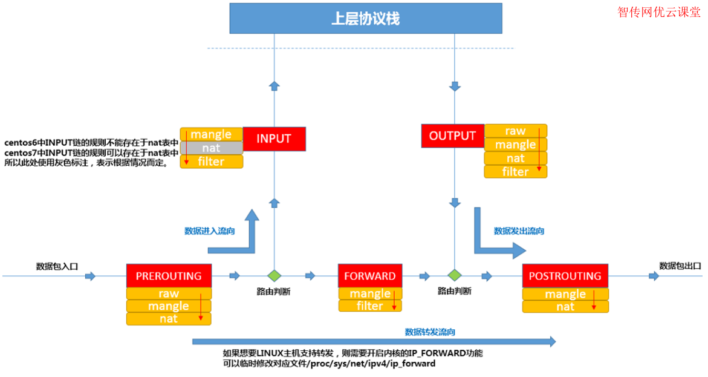

+++
title = 'Iptables学习笔记'
date = 2025-06-07 23:57:27
draft = false
slug = "0002"
cover ="./1.png"
description = "这是一篇iptables的学习笔记，是个人的理解。"
keywords = ["iptables","netfilter","snat","dnat"]
+++

> 这是一篇```iptables```的学习笔记，是个人的理解。
> ```iptables```对于我来说不常用到，所以每次用的时候都会再次学习，也没有深入的学习。学过的东西，久了不用，自然就忘了。所以在这里对个人的理解做一个笔记，方便下次用到的时候好看。

# 介绍
```iptables```是操作```netfilter```的工具，```netfilter```是Linux2.4.x之后新一代的Linux防火墙机制，是linux内核的一个子系统。```netfilter```采用模块化设计，具有良好的可扩充性。```iptables```从用户态连接到内核态的```netfilter```的架构中，```netfilter```与IP协议栈是无缝契合的，并允许使用者对数据报进行过滤、地址转换、处理等操作。
<!--more-->
# 原理理解

## 5链4表

在```netfilter```中，有5链4表，数据包在```netfilter```中的流向如下图：


5链是指：PREROUTING、INPUT、OUTPUT、FORWARD、POSTROUTING。
4表是指：raw>>>>mangle>>>>nat>>>>filter

数据包经过每一个链时，都会按照上面4张表的顺序查找表中的配置，根据配置来操作数据包。
> 需要注意的是，不是每一个链都会包含4张表，根据链所处的位置和目的不同，包含的表也不同。可以理解为在不同的链中，能进行的操作是有限制的，比如```FORWARD```连，仅用于将数据包从一个接口转发到另一个接口，不需要进行地址转换操作，所以没有```nat```表。

在这里，需要先了解清楚4表中每一个表记录的内容，才能更好的理解哪些链包含有哪些表：

* raw表
	raw是1.2.9以后版本的新增的表，根据raw表的配置，可以决定数据包是否被状态跟踪机制处理。
	数据包有4种跟踪连接状态：
	* NEW - 该包想要开始一个连接（重新连接或将连接重定向）
	* RELATED - 该包是属于某个已经建立的连接所建立的新连接。例如：FTP的数据传输连接就是控制连接所 RELATED出来的连接。`--icmp-type 0` ( ping 应答) 就是`--icmp-type 8` (ping 请求)所RELATED出来的。  
	* ESTABLISHED - 只要发送并接到应答，一个数据连接从NEW变为ESTABLISHED，而且该状态会继续匹配这个连接的后续数据包。  
	INVALID - 数据包不能被识别属于哪个连接或没有任何状态比如内存溢出，收到不知属于哪个连接的ICMP错误信息，一般应该DROP这个状态的任何数据。

* mangle表
	主要用于修改数据包的TOS（Type Of Service，服务类型）、TTL（Time To Live，生存周期）以及为数据包设置Mark标记，以实现Qos(Quality Of Service，服务质量)调整以及策略路由等应用。*我们在这里不多介绍此表。*

* nat表
	顾名思义，这个表主要用于网络地址转换，可用于修改数据包的IP地址、端口号等信息。
	
* filter表
	用于对数据包进行过滤，根据具体的规则决定是否放行该数据包（如DROP、ACCEPT、REJECT、LOG）。

## 数据包流向

通过上图，我们可以直观的理解数据包在```netfilter```中的流向。

1. 数据包通过网卡进来后，首先到达的是```PREROUTING```链。
2. 经过```PREROUTING```链处理后的数据，根据目的地址不同，会进入到不同的链。
	若目的地址是本机的地址，则会交给```INPUT```链来处理，表示数据包将进入到本机系统进行处理。
	若目的地址不在本机，则会对数据包进行转发，进入```FORWARD```链。
3. 进入```INPUT```的数据，经过处理后会交给上层协议(应用)来处理。
4. 上层应用发出的数据包，首先会经过```OUTPUT```处理后，再进行路由选择。
5. 从```FORWARD```链或```OUTPUT```链出来的数据，经过路由选择后，交给```POSTROUTING```连处理，并最后通过网卡发送出去。

> 数据包在上面的任何一个链中，都可以被丢弃。

### 连接跟踪表

连接跟踪表存储所有经过系统的网络连接状态信息。每个连接由​**​五元组（源IP、目的IP、协议号、源端口、目的端口）​**​唯一标识。例如：TCP连接 `10.1.1.2:55667 → 10.2.2.2:80` 会生成一条记录。每一条记录会记录连接的以下信息：

* 协议类型 - TCP/UDP/ICMP等
* 五元组信息 - 源/目的IP、端口、协议号
* 连接状态 - 如`NEW`、`ESTABLISHED`、`RELATED`
* 超时时间 - 空闲超时自动删除（如TCP默认30分钟）
* 流量统计 - 传输的数据包数量、字节数
* 反向五元组 - 记录响应方向的数据流信息

#### 运作机制

1.  ​**​连接创建​**​
    -   当新数据包到达时，内核提取其五元组，查询连接跟踪表。
    -   若无匹配记录，则创建新表项，状态标记为`NEW` 。
2.  ​**​状态更新​**​
    -   后续数据包命中表项后，更新连接状态（如TCP从`SYN_SENT`变为`ESTABLISHED`）。
    -   同时刷新超时时间，避免过早回收。
3.  ​**​垃圾回收（GC）​**​
    -   周期扫描表项，删除超时或无效（`INVALID`）记录。
    -   标记为`ASSURED`的记录（双向通信确认）优先保留。

了解了**连接跟踪表**以后，就知道了如果在高并发状态下很容易造成连接跟踪表溢出，在这种场景下，可以通过配置```raw```表，要求不记录到连接跟踪表中。既然是为了提高性能，绕过连接跟踪表，很容易就想到是在数据包刚刚在系统中产生的时候就进行标记，根据上面的描述，数的在系统中产生有两个时机：刚进入网卡(PREROUTING)、刚由应用程序发出(OUTPUT)。看上图，raw表也仅存在于这两个链中。

在```PREROUTING```中，可以对数据包的五元组信息进行修改，以便调整数据包在后续的流向。所以在```PREROUTING```链中，有nat表。

```FORWARD```链的作用，仅仅是将数据包从一个接口转发到另一个接口上，所以在这个链中，没有过多的复杂的操作。仅仅使用了```mangle```和```filter```表。

# 应用场景

## SNAT

**SNAT**即源地址转换，主要用于从局域网访问互联网时，将局域网IP地址转换为可以在互联网上使用的IP地址。根据原理，很容易确定是在将数据包发送到互联网上时进行转换，所以这个操作应该在```POSTROUTING```上操作。

## DNAT

**DNAT**即目的地址转换。在互联网上要访问内部的服务时，只能访问到网关上的端口，当数据一到达网关时，就需要修改目的地址，便于数据包的后续处理流程。根据原理，可以确定这个操作应该在```PREROUTING```链中进行。

## 路由服务

在不需要NAT的情况下，由于只需要将数据从一个网络发送到另一个网络，两个网络通过同一台服务器的两个不同网卡进行连接，所以就需要根据路由规则，将数据从进入的网卡转发到另一个网卡发出。这个转发操作就是在```FORWARD```链。所以配置路由时，就一定要在```FORWARD```链的```filter```表中，允许数据包的转发。

**数据包的转发，需要在操作系统的内核中开启ipv4.ip_forward。**

```bash
sysctl -w net.ipv4.ip_forward=1 # 临时生效 
echo "net.ipv4.ip_forward=1" >> /etc/sysctl.conf # 永久生效
```

可以说，```FORWARD``` 链是构建 ​**​Linux 网络防火墙​**​ 和 ​**​路由器功能​**​ 的基石。

## 安全控制

通过在链中对数据包进行```DROP```、```ACCEPT```、```REJECT```操作，可以设置白名单或黑名单的访问模式，从而拒绝未知的访问者对服务的访问。

在每个链上，可以设置一个默认规则，当没有匹配的详细规则时，则使用默认规则。
```bash
iptables -P INPUT DROP
```

# iptables命令

对```netfilter```的操作，就是将配置写入到各个链上相应的表中，主要是通过```iptables```来完成。

## 查看

### 查看全部配置
用于列出```netfilter```中的各种配置，通过命令```iptables --list```完成。通过```-n```参数可以以数字形式显示IP和端口。

```bash
iptables --list -n
```
### 查看指定链表配置

* -t  指定需要操作的表
* -L 指定要操作的链

可以通过指定```-t```和```-L```参数指定需要查看的表和链，链和表必须同时指定。

```bash
iptables -L PREROUTING -t nat
```
## 写入配置

对表的操作可以分为追加( A )、插入( I )、替换( R )、删除( D )，在写入时，也必须同时指定链和表。

```bash
iptables -t nat -A POSTROUTING -o edge0 -j MASQUERADE
```

## 清空规则

可以使用```-F```参数清空```netfilter```的所有规则，也强以清空指定链上的规则。

```bash
iptables -F # 清空所有规则
iptables -F INPUT # 清空INPUT上的所有规则
```

## 其它操作

```iptables```有很多操作参数，具体的使用可以通过```--help```来查看，也可以参考其它文章来了解。
