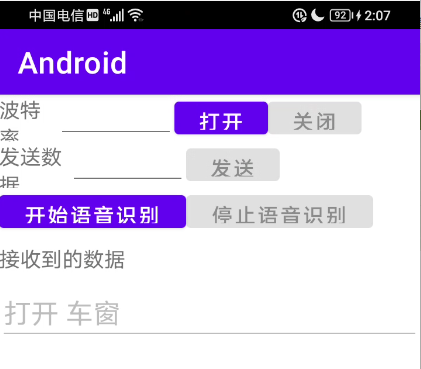

+++
title = '使用Vosk Model在安卓上开发语音识别APP'
date = 2025-09-15T23:48:53+08:00
draft = false
slug = 'vosk-android'
description = "在Android APP中，使用Vosk实现语音转文本，并介绍麦克风权限申请流程。"
keywords = ["Android","语音识别","语音转文本","Vosk"]
cover = "./1.png"
+++

```Vosk```有大模型和小模型两种，对应不同的使用场景。

**大模型**

大模型由于使用了先进的 AI 算法，所以要求的资源比较高，需要至少16GB的内存(RAM)，主要用于在服务器上进行高精度的转录。

最新的大模型大小约2GB。

**小模型**

小模型大小仅仅约50MB，运行时内存(RAM)大约需要300MB，非常适合移动应用程序上的有限任务。可以在智能手机、Raspberry Pi 上运行。

**当然也包括车机设备。**

<!--more-->

# 下载

你可以在官方网站上下载到Vosk的模型文件。

下载地址：[https://alphacephei.com/vosk/models](https://alphacephei.com/vosk/models)

> 根据官方网站显示，Vosk提供了多种语言的版本，我们在这里需要找到中文的版本。

由于我们的APP运行于车机设备上，在这里我们只需要下载小模型即可。直达地址：[https://alphacephei.com/vosk/models/vosk-model-small-cn-0.22.zip](https://alphacephei.com/vosk/models/vosk-model-small-cn-0.22.zip)

> 你必须在使用前创建一个Android项目。

下载好之后的文件是一个zip的压缩包，需要解压后放入到Android项目的assets目录，目录结构如下：

```
app/src/main/assets/model-small-cn-0.22/am
                                        conf
                                        graph
                                        ivector
                                        README
                                        uuid 
```
在下载的包中是没有```uuid```这个文件里，可以手动创建一个，在里面写入一个字符串做为id，你可以使用guid程序生成一个。

# 使用

## 添加依赖

在使用Vosk之前，需要先添加依赖包(SDK)，其封装了常用的功能，我们可以在Android上直接调用，简化开发工作量。

在Android Studio中，编辑文件build.gradle(位置：app/build.gradle)，在```dependencies```中加入以下内容：

```gradle
    implementation 'net.java.dev.jna:jna:5.13.0@aar'
    implementation 'com.alphacephei:vosk-android:0.3.47@aar'
```

然后点击右上角的```Sync Now```，等待同步完成就可以在项目中使用了。

## 添加权限申请

由于我们需要从麦克风接收语音数据，需要向用户申请麦克风使用权限。在```app/src/main/AndroidManifest.xml```文件中添加如下代码：

```xml
<?xml version="1.0" encoding="utf-8"?>
<manifest xmlns:android="http://schemas.android.com/apk/res/android"
    xmlns:tools="http://schemas.android.com/tools">
    <uses-permission android:name="android.permission.RECORD_AUDIO" />
    ...
</manifest>
```

> 其中```<uses-permission android:name="android.permission.RECORD_AUDIO" />```是我们新添加的代码。

> 在```Android 6.0+```以上的系统中，还需要在APP运行时动态申请权限，这个我们在后面会说。

## UI设计 

我们只是开发一个简单的Demo程序，就只设计了两个按钮（一个开始，一个停止），一个文本显示框（用来实时显示语音文本）。

在```layout```下，找到对应的```xml```文件，添加按钮和文本框的布局信息。

```xml
<?xml version="1.0" encoding="utf-8"?>
<androidx.constraintlayout.widget.ConstraintLayout xmlns:android="http://schemas.android.com/apk/res/android"
    xmlns:app="http://schemas.android.com/apk/res-auto"
    xmlns:tools="http://schemas.android.com/tools"
    android:id="@+id/main"
    android:layout_width="match_parent"
    android:layout_height="match_parent"
    tools:context=".MainActivity">
<LinearLayout
    android:layout_width="match_parent"
    android:layout_height="match_parent"
    android:orientation="vertical"
    >
    ...
    <LinearLayout
        android:layout_width="match_parent"
        android:layout_height="40dp"
        android:orientation="horizontal">

        <Button
            android:layout_width="160dp"
            android:layout_height="match_parent"
            android:enabled="true"
            android:id="@+id/btnOpenRec"
            android:text="开始语音识别" />
        <Button
            android:layout_width="160dp"
            android:layout_height="match_parent"
            android:enabled="false"
            android:id="@+id/btnCloseRec"
            android:text="停止语音识别" />
    </LinearLayout>
    <LinearLayout
        android:layout_width="match_parent"
        android:layout_height="40dp"
        android:orientation="horizontal">
        <TextView
            android:layout_width="200dp"
            android:layout_height="match_parent"
            android:gravity="center_vertical"
            android:text="接收到的数据" />

    </LinearLayout>
    <LinearLayout
        android:layout_width="match_parent"
        android:layout_height="wrap_content">

        <EditText
            android:id="@+id/txtReceiver"
            android:layout_width="match_parent"
            android:layout_height="match_parent"
            android:enabled="false"
            android:inputType="textMultiLine" />
    </LinearLayout>
</LinearLayout>

</androidx.constraintlayout.widget.ConstraintLayout>
```

> 这里我们简单的使用了```LinearLayout```来布局。

## 功能实现

```Vosk```使用的流程如下：

0. 动态申请权限。
1. 从APP中释放出模型文件，并初始化为SDK中的```Model```类。
2. 使用前面创建的model做为参数创建一个```Recognizer```类。
3. 使用```Recognizer```作为参数创建一个```SpeechService```。
4. ```SpeechService```调用```startListening```开始从麦克风接收语音数据。
5. ```SpeechService```在接收到文本数据后，调用回调函数，进入用户的代码。
6. 用户根据状态和对应的文本进行相应的操作。

在上面的流程中，提到了```Model```、```Recognizer```和```SpeechService```三个类，他们的作用如下表：

|类名 / 对象|主要职责|关键说明|
|---|---|---|
|Model|识别知识库​|包含识别一种特定语言所需的全部数据。不同的模型文件（如中文小模型、英文模型）对应不同的语言识别能力。|
|Recognizer|​​核心识别引擎|负责加载模型和执行语音转文本的算法。它接收音频数据，并输出识别结果。它的性能直接决定了识别的准确率和速度。|
|SpeechService|音频管理与调度器​|封装了音频录制的细节，管理录音生命周期，并作为Recognizer和音频输入硬件之间的桥梁。它简化了识别流程的使用。|

### 动态权限申请

在用户点击按钮**btnOpenRec**后，我们打开麦克风开始识别用户输入的语音信号前，需要先判断APP是否有使用麦克风的权限，如果没有，则需要申请麦克风权限，如果有的话，就可以直接开始进行语音识别。

> 申请权限是一个异步操作，一般是将需要***使用***权限的功能封装为一个单独的功能函数，在调用这个功能函数前先判断是否有权限，如果有权限则直接调用，如果没用，则进行权限申请，当申请权限成功后，再次调用封装的功能函数。

检查权限，需要使用```ContextCompat.checkSelfPermission```，如果具有权限，则会返回```PackageManager.PERMISSION_GRANTED```，只要不是这个值，就没有权限，我们这里不做细分，直接进入权限申请流程。

申请权限，需要使用```ActivityCompat.requestPermissions```，在申请权限的时候，可以一次性申请多个权限，以数组作为参数传入。同时，我们在申请权限的时候还需要传入一个请求码，用于授权完成后的回调。

当用户确认授权后，会调用```onRequestPermissionsResult```，我们需要在这里判断请求码和授权结果进行不同的操作。

|方法名|所属类|核心作用|关键参数|
|---|---|---|---|
|ContextCompat.checkSelfPermission|ContextCompat|检查​​是否拥有某个权限|Context context, String permission|
|ActivityCompat.requestPermissions|ActivityCompat|​​请求​​用户授予某个或多个权限|Activity activity, String[] permissions, int requestCode|
|onRequestPermissionsResult|Activity/Fragment|处理​​权限请求的结果|int requestCode, String[] permissions, int[] grantResults|

下面是我们权限检查申请的具体实现：

```java
    private static final String PERMISSIONS_RECORD_AUDIO =Manifest.permission.RECORD_AUDIO;
    private static final int RECORD_AUDIO_PERMISSION_REQUEST_CODE = 308; // 唯一的请求码
    /**
     * 检查权限，如果未授予则请求权限
     */
    private boolean checkAndRequestPermissions() {
        // 检查是否已拥有所有需要的权限
        if ((ContextCompat.checkSelfPermission(this, PERMISSIONS_RECORD_AUDIO) != PackageManager.PERMISSION_GRANTED)) {
            // 如果没有所有权限，则请求它们
            ActivityCompat.requestPermissions(this, new String[]{PERMISSIONS_RECORD_AUDIO}, RECORD_AUDIO_PERMISSION_REQUEST_CODE);
            return false;
        } else {
            // 所有权限都已授予，可以执行需要权限的操作
            return true;
        }
    }

    /**
     * 处理权限请求结果
     */
    @Override
    public void onRequestPermissionsResult(int requestCode, @NonNull String[] permissions, @NonNull int[] grantResults) {
        super.onRequestPermissionsResult(requestCode, permissions, grantResults);

        // 检查收到的响应是否对应我们的请求
        if (requestCode == RECORD_AUDIO_PERMISSION_REQUEST_CODE) {
            // 检查所有权限是否都被授予，我们这里只使用了一个权限。
            boolean allGranted = true;
            for (int grantResult : grantResults) {
                if (grantResult != PackageManager.PERMISSION_GRANTED) {
                    allGranted = false;
                    break;
                }
            }

            if (allGranted) {
                // 执行需要权限的操作，当前请求码对应的是开始识别语音
                StartListening();
            } else {
                // 至少有一个权限被拒绝
                Toast.makeText(this,"权限被拒绝，无法使用当前功能",Toast.LENGTH_SHORT).show();
            }
        }
    }
```

### 初始化Model

初始化就是将资源文件中的模型文件释放到存储空间上，再用路径作为参数来创建```Model```，我们使用SDK中提供的```StorageService.unpack ```方法来释放。

```java
    private Model model;
    private void  InitVoskModel(){
        StorageService.unpack(this, "model-small-cn-0.22", "model",
                (model) -> {
                    this.model = model;
                    //setUiState(STATE_READY);
                    Toast.makeText(MainActivity.this, "模型初始化成功", Toast.LENGTH_SHORT).show();
                },
                (exception) -> {
                    Log.e("MODEL",exception.toString());
                    Toast.makeText(MainActivity.this, "模型解包失败" + exception.getMessage(), Toast.LENGTH_SHORT).show();
                });
    }
```

> 我们在当前类中，定义了一个私有属性```model```，初始化可以在```onCreate```进行，整个生命周期中只需要初始化一次。

### 语音识别

我们将前面2、3、4整合到一个方法中。

```java
    private SpeechService speechService;
    private void StartListening(){
        if(this.model==null){
            Toast.makeText(MainActivity.this, "模型未初始化。", Toast.LENGTH_SHORT).show();
            return;
        }
        try {
            Recognizer recognizer = new Recognizer(model, 16000.0f);
            if(speechService==null) {
                speechService = new SpeechService(recognizer, 16000.0f);
            }
            speechService.startListening(this);

        } catch (IOException e) {

            Toast.makeText(this,e.getMessage(),Toast.LENGTH_SHORT).show();
            e.printStackTrace();
            return;
        }
        btnCloseRec.setEnabled(true);
        btnOpenRec.setEnabled(false);
    }
```

> 需要注意的是，在```Recognizer```和```SpeechService```的第二个参数是音频的采样率，两处需要保持一致。

在这里，我们传入了```this```作为回调参数，这是一个```RecognitionListener```的接口，所以我们需要在当前类中实现接口函数。

```java
public class MainActivity extends AppCompatActivity implements RecognitionListener {
    ...
    private String getJsonField(String text,String field){
        try {
            JSONObject jsonObject = new JSONObject(text);
            String txt = jsonObject.getString(field);
            return  txt;

        } catch (JSONException e) {
            // throw new RuntimeException(e);
        }
        return "";
    }
    @Override
    public void onPartialResult(String hypothesis) {
        String text=getJsonField(hypothesis,"partial");
        text = text.replaceAll("\\s+", "");
        if(!text.isEmpty()) txtReceiver.setText(text);
    }

    @Override
    public void onResult(String hypothesis) {
        String text=getJsonField(hypothesis,"partial");
        if(!text.isEmpty()) txtReceiver.setText(text);
    }

    @Override
    public void onFinalResult(String hypothesis) {
        String text=getJsonField(hypothesis,"text");
        if(!text.isEmpty()) txtReceiver.setText(text);
        btnCloseRec.callOnClick();
    }

    @Override
    public void onError(Exception exception) {
        btnCloseRec.callOnClick();
        Toast.makeText(this,exception.getMessage(),Toast.LENGTH_SHORT);
    }

    @Override
    public void onTimeout() {
        btnCloseRec.callOnClick();
        Toast.makeText(this,"超时错误。",Toast.LENGTH_SHORT);
    }
    ...
}    
```

作为文本处理，主要关注```onPartialResult```、```onResult```、```onFinalResult```。

这三个方法中，参数```hypothesis```是一个JSON字符串，其中包含了```partial```和```text```两个字段，partial是实时的语音识别结果，text是最终的语音识别的结果。

* onPartialResult - 实时输入识别结果，一般用于一边说话一边显示文字。
* onResult - 在检测到用户停顿后调用。
* onFinalResult - 音频结束后调用。

语音输入中，一般将onResult的结果作为完整指令。

# 结束

模型的使用其实就是按步就班的按照文档进行调用即可，我们开发的时候主要处理的是各种异步，并给用户一个友好的输入窗口。

好了，还是贴个图吧。

