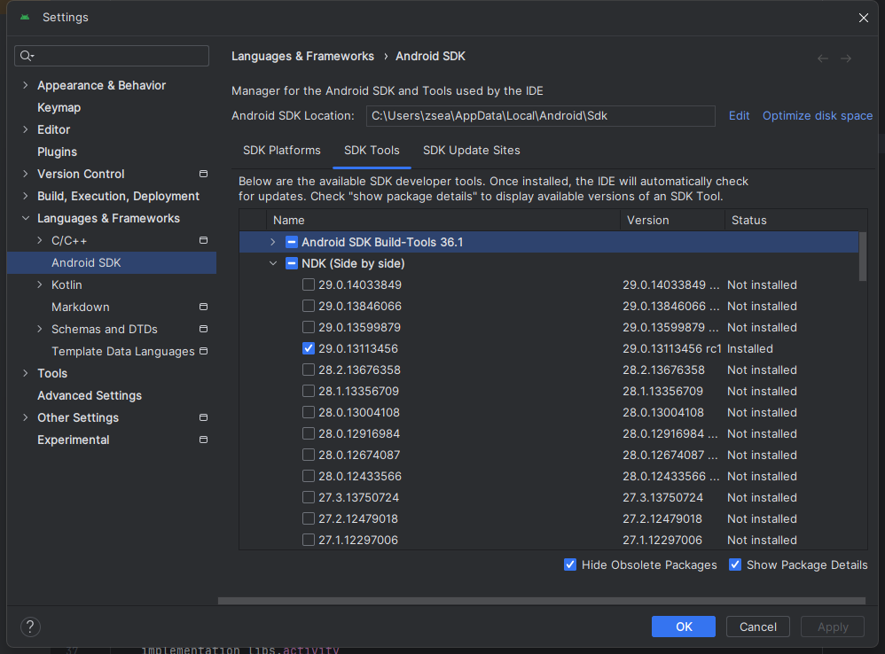

+++
title = 'JNI极速入门'
date = 2025-09-18T19:56:38+08:00
draft = false
slug = 'jni'
description ='JNI极速入门，JNI学习笔记，Java Native Interface，对JNI使用方法的学习'
keywords =['JNI','Java Native Interface']
cover = './image.png'
+++

```JNI```(Java Native Interface，Java本地接口)，是Java平台的标准组成部分，是Java与本地代码连接的桥梁。在Android开发中，普遍通过NDK来使用JNI。

> 用大白话说就是，要在Java中调用C/C++的函数，就需要用JNI。

```NDK```(Native Development Kit)，是用于在Java代码中集成原生代码的工具集。

学习JNI，主要就是要明白JNI的规则：
* 在Java中的命名是什么样的？
* 在C/C++中的命名是什么的？
* 他们是如何关联起来的？

当然，我们的学习还是要从基本的环境搭建说起。

<!--more-->

> Android Studio的安装，我们就不介绍了。

# NDK安装

Android Studio为我们集成了NDK的安装选项，我们只需要勾选上即可。

打开``` File ---> Settings ---> Languages & Frameworks ---> Android SDK ```，选择选项卡```SDK Tools```，再在列表中找到```NDK(Side by side)```，勾选你需要的NDK版本，最后点击```OK```。



---

在上面，我们安装好了NDK，接下来我们就开始通过一个简单的例子来完成在Java中调用C/C++的代码。

# 目标描述

我们需要实现一个```Math```类，完成以下功能：

* 乘法(mul) - 传入两个参数，返回两个参数的乘积。
* 除法(div) - 传入两个参数，一个被除数，一个除数，返回余数和商。

# 实现过程

## 配置项目

在普通的项目中，是没有开启NDK的，所以我们如果要使用JNI，就需要先在```build.gradle```中配置好相关信息。

打开```app/build.gradle```文件，在```android ---> defaultConfig```中添加以下配置：

```gradle
externalNativeBuild {
    cmake {
        arguments "-DANDROID_ARM_NEON=TRUE", "-DANDROID_PLATFORM=android-21", "-DANDROID_STL=c++_shared"
        abiFilters 'armeabi-v7a', 'arm64-v8a'
    }
}
ndk {
    ldLibs "log", "z", "m"
    abiFilters "armeabi-v7a", "arm64-v8a"
}
```

在```externalNativeBuild```配置中，我们指定了使用```cmake```来进行构建，并设置了构建的参数，同时，指定了适配的CPU架构。

在```ndk```配置中，```ldLibs```指定了链接时需要包含的系统库。

在上面的配置中，同时存在```abiFilters```配置项，最终的so文件仅输出两个配置项中都存在(交集)的项。你也可以省略cmake中的abiFilters配置项。

然后，在```android```节点下添加以下配置：

```gradle
externalNativeBuild {
    cmake {
        path "src/main/cpp/CMakeLists.txt"
        version "3.10.2"
    }
}
sourceSets {
    main {
        jniLibs.srcDirs = ['src/main/jniLibs', 'libs']
    }
}
ndkVersion '21.0.6113669'
```
```externalNativeBuild```中配置了```cmake```的相关参数。

* path - 指定了```CMakeLists.txt```的位置
* version - 指定了cmake的版本。

> 这里的externalNativeBuild与defaultConfig中的externalNativeBuild作用是不一样的。
> * defaultConfig中​的 externalNativeBuild ​​告诉 Gradle “怎么构建”​​（指定编译参数和选项）。
> * 在 android块下​的 externalNativeBuild ​​告诉 Gradle “去哪找”和“用什么版本”来构建代码​​（指定脚本路径和版本）。

默认情况下，Android Studio 会到```src/main/jniLibs```目录下寻找按 ABI 子目录分好的 .so文件，我们这里又添加了一个libs目录。

```ndkVersion```用来指定NDK的版本，这里选择我们刚才安装的版本。

## 乘法实现

**1. 添加Java类**

我们在这里要添加的是带```native```的Java类，供在其它地方调用，在调用```native```方法时，Java会自动调用对应的```C```函数。

我们这里是在```app/src/main/java/com/example/demo```中添加的```Math```类。

按照目标，我们需要给这个类添加两个方法，这两个方法**一定**要用```native```来修饰。

```java
package com.example.demo;

// 我们这里先实现mul方法
public class Math {
    static {
        System.loadLibrary("math");
    }
    public static native int mul(int a,int b);
}
```

在调用```mul```前，需要先加载对应的库文件，将 System.loadLibrary()放在 static 静态代码块中是最可靠和推荐的方式。

**2. 添加CPP实现**

在```src/main/cpp```目录下添加```math.cpp```文件。

> 如果```cpp```目录不存在，则手动创建。

```cpp
#include <jni.h>

extern "C" jint Java_com_example_demo_Math_mul(JNIEnv* env, jclass self,jint a,jint b){
    return a*b;
}
```

* **extern "C"** - 明确导出函数的名称与我们写的一致。
* **jint** - 返回的是一个jint类型，Java会自动翻译成对应的java类型。
* **Java_com_example_demo_Math_mul** 函数名称，与```Math```中```mul```方法路径一致。JNI中，名称以```Java_```开头，后面接Java类中对应的方法路径。

函数参数：
* **JNIEnv*** - JNI环境。
* jclass - 静态方法中对应的类。
* **jint a,jint b** - mul对应的参数。

> 这里的写法都是按这个规则固定编写。

**4. 添加CMakeLists.txt**

将库的名称指定为前面System.loadLibrary中对应的名称，这里固为```math```。

在刚才cpp文件的目录添加一个**CMakeLists.txt**文件，内容哪下：

```cmake

# 指定最小版本
cmake_minimum_required(VERSION 3.10.2)

# 指定项目名称
project("math")

# 定义要构建的库
add_library(math # 目标库文件名称​​，Andorid上最终会生成 libmath.so
        SHARED # 指定生成的是动态连接库
        # 添加源文件，有多少个就添加多少个，这里只需要添加一个。
        math.cpp)
# 其它依赖库
target_link_libraries(math # 添加依赖库的目标（谁需要就写谁，这里是我们写的库需要，就写math
        # 添加的依赖库
        android
        log)
```

> target_link_libraries 是在连接阶段将依赖库和我们的目标连接到一起。

## 除法实现

我们在上面的基础上实现除法，根据需求，除法需要返回商和余数，我们定义一个```DivResult```类：

```java
package com.example.demo;

public class DivResult {
    public int Quotient,Remainder;
    public DivResult(int q,int r){
        this.Quotient=q;
        this.Remainder=r;
    }
}
```

在```Math```添加方法```div```：
```java
public static native DivResult div(int dividend,int divisor);
```

在cpp中添加对应的除法实现：
```cpp
extern "C" jobject Java_com_example_demo_Math_div(JNIEnv* env, jclass math,jint dividend,jint divisor){
    jint q=dividend/divisor;
    jint r=dividend%divisor;
    jclass DR = env->FindClass("com/example/demo/DivResult"); //获取类
    jmethodID constructor = env->GetMethodID(DR, "<init>", "(II)V"); //获取构造函数
    jobject dr = env->NewObject(DR, constructor,q,r);//调用构造函数，返回一个类的实例
    return dr;
}
```

在除法中，我们需要返回的是一个Java类的实例，需要使用JNIEvn来实现Java类的操作。

> 在FindClass中我们的类路径注意在release时，不要进行混淆，不然会找不到。

## 测试结果

固定使用```2*3```来测试乘法。


固定使用```10/3```来测试除法。


# 总结

```JNI```的学习，更多的是规则的学习，学习如何将我们学过的其它知识如何连接在一起。

在前面，为了快速把JNI的流程和规则说清楚，对于一些详细的规则我们没有细说，比如JNI的类型与Java基本类型如何对应、JNIEvn中如何调用静态方法、静态库如何初始化一些信息等，你需要去参考官方文档。

同时，前面使用到了```gradle```、```cmake```等，你也需要去学习他们的语法。

> 对于JNI所有的函数都可以在jni.h里找到原型。
