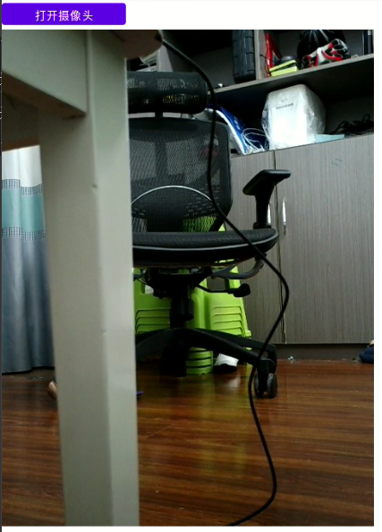
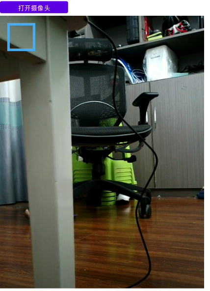

+++
title = '[Android开发]摄像头使用'
date = 2025-09-21T23:02:22+08:00
draft = false
slug = 'android-camerax'
description ='Android开发，摄像头使用'
keywords =['Android','Java','摄像头','CameraX']
+++

> 本篇是```Android```开发疲劳驾驶、人脸识别的基础篇。

在Android中，对摄像头的使用，主要依赖```CameraX```，我们将根据摄像头使用的范式(三板斧)来完成功能。

画面数据由摄像头产生后，经过```SurfaceTexture```，最终显示在```View```上，摄像头是硬件，会将产生的数据以帧的形式推送到```SurfaceTexture```，```SurfaceTexture```会不断的将数据显示在```View```，但是并不一定会将每一帧都显示出来，每次显示的时候，都会显示最新的帧，过期的帧会被舍弃。

<!--more-->

上面介绍了数据产生到显示的步骤，下面我们将按照步骤一步一步实现功能：

1. 在UI上显示摄像头画面
2. 在摄像头画面画上框 - 该功能实际是要根据检测到的人脸所在位置画框，这里暂时没有实现人脸检测。

# 依赖项

```CameraX```当前的最新版为**1.5.0**，我们这里由于Android Studio版本较低，不能安装高版本的AGP，所以选择了较低的版本。我们的版本是**1.3.4**。

> ```CameraX```的最版本版本可以通过[https://developer.android.com/jetpack/androidx/releases/camera?hl=zh-cn#1.3.4](https://developer.android.com/jetpack/androidx/releases/camera?hl=zh-cn#1.3.4)查询。

在```build.gradle```中添加以下代码到```dependencies```中，完成依赖项的设置。

```gradle
dependencies {

    ...

    def camerax_version = "1.3.4"
    implementation "androidx.camera:camera-core:${camerax_version}"
    implementation "androidx.camera:camera-camera2:${camerax_version}"
    implementation "androidx.camera:camera-lifecycle:${camerax_version}"
    implementation "androidx.camera:camera-video:${camerax_version}"
    implementation "androidx.camera:camera-view:${camerax_version}"
    implementation "androidx.camera:camera-extensions:${camerax_version}"

    ...
}
```

---

# 功能实现

> 我们先完成功能一。

在UI上，我们设计一个按钮，用于开启功能。

1. 添加UI

按钮就使用一个普通的按钮，摄像头数据显示则使用```CameraX```提供的```androidx.camera.view.PreviewView```类。UI布局如下：

```xml
<?xml version="1.0" encoding="utf-8"?>
<androidx.constraintlayout.widget.ConstraintLayout xmlns:android="http://schemas.android.com/apk/res/android"
    xmlns:app="http://schemas.android.com/apk/res-auto"
    xmlns:tools="http://schemas.android.com/tools"
    android:id="@+id/main"
    android:layout_width="match_parent"
    android:layout_height="match_parent"
    tools:context=".CameraActivity">
    <LinearLayout
        android:layout_width="match_parent"
        android:layout_height="match_parent"
        android:orientation="vertical"
        >
        <LinearLayout
            android:layout_width="match_parent"
            android:layout_height="40dp"
            android:orientation="horizontal">

            <Button
                android:layout_width="160dp"
                android:layout_height="match_parent"
                android:enabled="true"
                android:id="@+id/btnOpenCamera"
                android:text="打开摄像头" />

        </LinearLayout>
        <FrameLayout
            android:layout_width="480dp"
            android:layout_height="640dp">
            <androidx.camera.view.PreviewView
                android:id="@+id/previewView"
                android:layout_width="match_parent"
                android:layout_height="match_parent"
                app:layout_constraintBottom_toBottomOf="parent"
                app:layout_constraintEnd_toEndOf="parent"
                app:layout_constraintStart_toStartOf="parent"
                app:layout_constraintTop_toTopOf="parent" />
            
        </FrameLayout>

    </LinearLayout>
</androidx.constraintlayout.widget.ConstraintLayout>
```

这里使用了```FrameLayout```，便于后期绘制方框。

2. 权限申请

> 根据设计，在用户点击按钮```btnOpenCamera```就需要打开摄像头显示数据，但在正式使用摄像头前，需要检查和申请摄像头的权限。

权限的申请需要先在```AndroidManifest.xml```添加使用的权限列表，然后再动态申请，具体请参考[使用Vosk Model在安卓上开发语音识别APP](../vosk-android/)。

在```AndroidManifest.xml```中添加以下内容：

```xml
<uses-feature
        android:name="android.hardware.camera"
        android:required="false" />

    <uses-permission android:name="android.permission.RECORD_AUDIO" />
    <uses-permission android:name="android.permission.CAMERA" />
```

在```CameraActivity```类中添加以下权限申请代码：

```java
public class CameraActivity extends AppCompatActivity {
    private final int REQUEST_CODE_PERMISSIONS = 101;
    private final String[] REQUIRED_PERMISSIONS = new String[]{android.Manifest.permission.CAMERA, Manifest.permission.RECORD_AUDIO};
    private boolean checkAndRequestPermissions(){
        for (String permission : REQUIRED_PERMISSIONS) {
            if (ContextCompat.checkSelfPermission(this, permission) != PackageManager.PERMISSION_GRANTED) {
                ActivityCompat.requestPermissions(this,REQUIRED_PERMISSIONS,REQUEST_CODE_PERMISSIONS);
                return false;
            }
        }
        return true;
    }
    @Override
    public void onRequestPermissionsResult(int requestCode,String[] permissions,int[] grantResults) {
        super.onRequestPermissionsResult(requestCode, permissions, grantResults);
        if(requestCode==REQUEST_CODE_PERMISSIONS){
            boolean grantAll=true;
            for(int grant:grantResults){
                if(grant!=PackageManager.PERMISSION_GRANTED){
                    grantAll=false;
                    break;
                }
            }
            if(!grantAll){
                Toast.makeText(this,"权限不完整，无法开启该功能。",Toast.LENGTH_SHORT).show();
            }
            else {
                StartCamera();
            }

        }
    }
}
```

> 在这里，同时也申请了录音的权限，因为大多数时候摄像和录音是同时进行的。

3. 显示摄像头数据

在申请权限成功后，会调用函数```StartCamera()```开始摄像头数据显示，在这里，会开始我们使用摄像头的固定模式。

```java
    private void StartCamera(){
        
        ListenableFuture<ProcessCameraProvider> cameraProviderFuture= ProcessCameraProvider.getInstance(this);
        cameraProviderFuture.addListener(()->{
            try {
                // Future 完成后，通过 get() 方法获取 ProcessCameraProvider 实例
                cameraProvider = cameraProviderFuture.get();
                // 调用 bindPreview 来设置和绑定相机用例
                bindPreview();
            } catch (ExecutionException | InterruptedException | CameraInfoUnavailableException e) {
                // 错误处理
                Log.e(TAG, "获取 CameraProvider 失败", e);
                //Toast.makeText(this, "没有可用的摄像头", Toast.LENGTH_SHORT).show();
            }
        }, ContextCompat.getMainExecutor(this));
    }
```

通过```ProcessCameraProvider```获取一个```ListenableFuture<ProcessCameraProvider>```，并在```CameraProvider```准备好后开始显示数据。这里是调用```bindPreview()```。

```java
    private void bindPreview() throws CameraInfoUnavailableException {
        if (cameraProvider == null) {
            Log.e(TAG, "CameraProvider 未初始化");
            return;
        }
        // 1. 除除掉以前的摄像头绑定。
        cameraProvider.unbindAll();
        // 2. 构造一个摄像头数据配置，这里设置了图像大小为480x640。
        preview = new Preview.Builder().setTargetResolution(new Size(480, 640)).build();
        /**
         * 3. 构造摄像头参数
         *  requireLensFacing - 用于设置使用哪个摄像头(前置/后置):CameraSelector.LENS_FACING_BACK/CameraSelector.LENS_FACING_FRONT
         */
        CameraSelector cameraSelector= new CameraSelector.Builder()
                .requireLensFacing(this.lensFacing)
                .build();
        // 4. 将preview的数据对接到previewView
        preview.setSurfaceProvider(previewView.getSurfaceProvider());

       cameraProvider.bindToLifecycle(this,cameraSelector,preview);
    }
```

在这里，都是固定的步骤，已在代码中给出了详细的注释。

代码中```previewView```，就是我们前面```xml```中定义的```androidx.camera.view.PreviewView```实例。

测试效果如下，正确获取到摄像头数据。



---

对于功能二，有两种方式：
1. 对每一帧进行处理，在每一帧的画面上画上框。
2. 在```androidx.camera.view.PreviewView```上添加一个绘画层，用于绘制相关信息。

从性能上来说，方式二更优，我们选择方式二。

1. 修改前面的布局文件：

```xml
<?xml version="1.0" encoding="utf-8"?>
<androidx.constraintlayout.widget.ConstraintLayout xmlns:android="http://schemas.android.com/apk/res/android"
    xmlns:app="http://schemas.android.com/apk/res-auto"
    xmlns:tools="http://schemas.android.com/tools"
    android:id="@+id/main"
    android:layout_width="match_parent"
    android:layout_height="match_parent"
    tools:context=".CameraActivity">
    <LinearLayout
        android:layout_width="match_parent"
        android:layout_height="match_parent"
        android:orientation="vertical"
        >
        <LinearLayout
            android:layout_width="match_parent"
            android:layout_height="40dp"
            android:orientation="horizontal">

            <Button
                android:layout_width="160dp"
                android:layout_height="match_parent"
                android:enabled="true"
                android:id="@+id/btnOpenCamera"
                android:text="打开摄像头" />

        </LinearLayout>
        <FrameLayout
            android:layout_width="480dp"
            android:layout_height="640dp">
            <androidx.camera.view.PreviewView
                android:id="@+id/previewView"
                android:layout_width="match_parent"
                android:layout_height="match_parent"
                app:layout_constraintBottom_toBottomOf="parent"
                app:layout_constraintEnd_toEndOf="parent"
                app:layout_constraintStart_toStartOf="parent"
                app:layout_constraintTop_toTopOf="parent" />
            <com.example.demo.DrawView
                android:layout_width="match_parent"
                android:layout_height="match_parent"
                android:id="@+id/viewDrawer"
                />
        </FrameLayout>

    </LinearLayout>
</androidx.constraintlayout.widget.ConstraintLayout>
```

```com.example.demo.DrawView```是我们的一个自定义绘画```View```，通过它，我们能实现绘制我们想要的内容。

通过```FrameLayout```实现```com.example.demo.DrawView```位于```androidx.camera.view.PreviewView```的上层。

2. 实现```com.example.demo.DrawView```

```java
package com.example.demo;

import android.content.Context;
import android.graphics.Canvas;
import android.graphics.Color;
import android.graphics.Paint;
import android.graphics.RectF;
import android.util.AttributeSet;
import android.view.View;

import androidx.annotation.NonNull;
import androidx.annotation.Nullable;
import androidx.camera.core.CameraSelector;

import java.util.ArrayList;
import java.util.List;

public class DrawView  extends View {
    private final Paint paint;
    private final List<RectF> rectBoxes = new ArrayList<RectF>();
    // 图像源的尺寸，用于坐标转换
    // 当前摄像头是否为前置摄像头，用于镜像翻转
    private int lensFacing = CameraSelector.LENS_FACING_BACK;
    private int sourceWidth;
    private int sourceHeight;
    public DrawView(Context context, @Nullable AttributeSet attrs) {
        super(context, attrs);

        // 初始化画笔，用于绘制框
        paint = new Paint();
        paint.setColor(Color.parseColor("#42A5F5")); // 设置一个漂亮的蓝色
        paint.setStyle(Paint.Style.STROKE); // 设置为空心框
        paint.setStrokeWidth(6.0f); // 设置线宽
    }
    /**
     * 从外部接收检测到的数据并触发重绘
     * @param boxes 需要画框的位置
     * @param sourceWidth 分析图像的宽度
     * @param sourceHeight 分析图像的高度
     * @param lensFacing 当前相机的朝向 (前置/后置)
     */
    public void updateBoxes(List<RectF> boxes, int sourceWidth, int sourceHeight, int lensFacing) {
        this.sourceWidth = sourceWidth;
        this.sourceHeight = sourceHeight;
        this.lensFacing = lensFacing;

        // 清空上一次的框
        rectBoxes.clear();

        rectBoxes.addAll(boxes);

        // 关键：触发 onDraw 方法进行重绘
        invalidate();
    }
    @Override
    protected void onDraw(@NonNull Canvas canvas) {
        super.onDraw(canvas);

        // 如果源尺寸未设置，则不绘制
        if (sourceWidth == 0 || sourceHeight == 0) {
            return;
        }

        // 遍历所有转换好的框并绘制出来
        for (RectF box : rectBoxes) {
            canvas.drawRect(box, paint);
        }
    }
}

```

在```DrawView```中，通过```updateBoxes```添加绘制的相关信息，并通过```onDraw```绘制到UI上。

> ```DrawView```能正常运行，但不是一个完整的类，我们在后期会丰富完善该类。在实际上，我们需要根据摄像头的画面，实时在不同的位置画框。比如人脸的位置。

3. 分析摄像头画面，确定画框的位置

在```bindPreview```中，我们需要添加一个图像分析器，根据分析结果确定在哪里画框。

**实现分析器**

分析器需要实现接口```ImageAnalysis.Analyzer```，我们的分析器叫做```FaceDetectionAnalyzer```，目的是检测人脸位置，人脸检查的功能将在后面实现。

```java
package com.example.demo;

import android.graphics.Matrix;
import android.graphics.RectF;
import android.util.Log;
import android.util.Size;

import androidx.annotation.NonNull;
import androidx.annotation.Nullable;
import androidx.camera.core.ImageAnalysis;
import androidx.camera.core.ImageProxy;

import java.util.ArrayList;
import java.util.List;

public class FaceDetectionAnalyzer implements ImageAnalysis.Analyzer {
    private final DrawView viewDrawer;
    private final int lensFacing;
    public FaceDetectionAnalyzer(@NonNull DrawView drawer,int lensFacing){
        this.viewDrawer=drawer;
        this.lensFacing=lensFacing;
    }
    @Override
    public void analyze(@NonNull ImageProxy image) {
        int height=image.getHeight(),width=image.getWidth();
        image.close();
        List<RectF> boxes=new ArrayList<RectF>();
        boxes.add(new RectF(20,20,80,80));
        if(this.viewDrawer==null){
            Log.e("DRAW_VIEW","对象为空");
            return;
        }
        // 绘制框到UI上
        this.viewDrawer.updateBoxes(boxes,width,height,this.lensFacing);
    }

}

```

通过```analyze```中的```ImageProxy```，我们可以获取图形数据，根据这些数据，我们可以完成人脸检测。

在这里，固定了框的位置，我们将在后面完善相关功能。

**应用人脸检测**

在前面的```bindPreview```添加以下代码，实现图形数据分析。

```java
ImageAnalysis imageAnalysis = new ImageAnalysis.Builder()
                .setTargetResolution(new Size(480, 640)) // 可以为分析设置一个合适的分辨率
                .setBackpressureStrategy(ImageAnalysis.STRATEGY_KEEP_ONLY_LATEST) // 关键：只处理最新一帧，防止延迟
                .build();

        // 为 imageAnalysis 设置分析器
        imageAnalysis.setAnalyzer(ContextCompat.getMainExecutor(this), new FaceDetectionAnalyzer(this.viewDrawer,lensFacing));

       cameraProvider.bindToLifecycle(this,cameraSelector,preview,imageAnalysis);
```

看效果，已经完成了画框。



# 结尾

本篇仅仅是人脸识别、疲劳检测的前篇，后面我们将逐步完成整个功能。

# 参考文档 

* [https://developer.android.com/jetpack/androidx/releases/camera?hl=zh-cn#1.3.4
](https://developer.android.com/jetpack/androidx/releases/camera?hl=zh-cn#1.3.4
)
* [https://developer.android.com/codelabs/camerax-getting-started?hl=zh-cn#0](https://developer.android.com/codelabs/camerax-getting-started?hl=zh-cn#0)