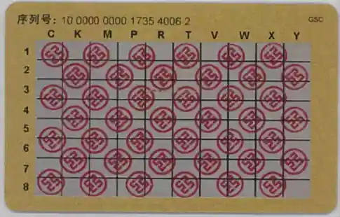
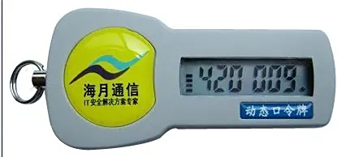
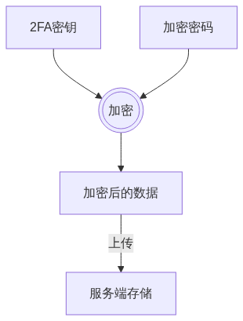
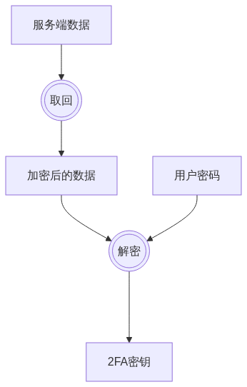
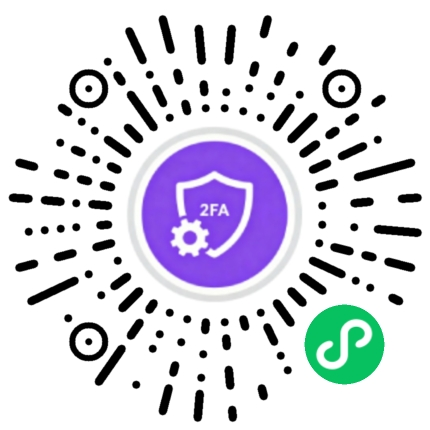

+++
title = '2FA原理学习'
date = 2025-10-14T22:00:04+08:00
draft = true
slug = '2fa'
description ='2FA原理介绍，Two-Factor Authentication'
keywords =['2FA','TOTP','Two-Factor Authentication']
+++

现在大多数知名的网站（平台）都开启了两步验证，即在你登录的时候，除了需要验证账号和密码外，还需要验证2FA生成的密码。不过，国内的一些平台，一般是通过短信进行二次验证，要求高一些的，会要求人脸验证。

在十多年前，使用网银转账的时候，银行会给你一张动态口令卡，卡上有横坐标与纵坐标，在转账的时候，银行会要求你输入指定横坐标与纵坐标交叉位置数字来进行二次验证。



另外，银行也提供另一种基于硬件的动态口令牌，口令牌会基于时间生成验证码。在进行转账操作的时候，会要求你输入口令牌上的数字进行验证。



当然，我们普通的网站平台不会有这么高的要求。在国内由于实名制的原因，一般是通过手机短信进行二次验证。在国外，一般使用一种基于时间的一次性口令技术来进行二次验证。

<!--more-->

# 2FA（Two-Factor Authentication）

2FA（Two-Factor Authentication），中文叫做双因素认证。我们现在一般使用的是HOTP算法。

## HOTP（HMAC-based One-Time Password）

HOTP（HMAC-based One-Time Password），中文叫做基于哈希的消息认证码。这个算法用于验证消息的合法性，与常见的哈希算法的区别是，还需要额外提供一串密钥，俗称加盐（salt 或 nonce），生成一串独一无二的哈希值。

在HOTP中，除了提供密钥外，还需要一个计数器，用于生成HASH值。在**RFC4226#section-5.1**中规定，这个计数器必须为一个 8-byte 的整数，即 Int64，高位字节若不足应填充 0x00。

假设密钥为```k='X5CTBOMEYE3TXIIS'```，计数器为```c=1```，那通过下面的计算得到HASH值。

```javascript
const crypto = require('crypto');
let k='X5CTBOMEYE3TXIIS';
let c=1;
let hmac_sha1=crypto.createHmac('sha1',k);
let buffer=Buffer.from([0,0,0,0,0,0,0,c]);
hmac_sha1.update(buffer);
const signature = hmac_sha1.digest('hex');
console.log(signature);
```

到这里，我们就计算出了一个20字节的HASH值，如果直接让用户进行输入的话，会非常麻烦。因此，我们还需要将这串HASH值转换为便于用户输入的数字（一般是6位长度）。这个转换算法如下描述：

> 取摘要结果最后一个字节的低 4 位，作为偏移值，然后以该偏移值为下标，从摘要中取从下标为该偏移值开始的 4 个字节，按大端模式组合成一个纯数字并忽略符号位，再取这个数字的后六位，高位长度不足 6 的应补上 0。

我们用上面计算的结果举例：

```
b9 2c 9b 08 bd 87 5a b8 f1 d8 8f b7 df c1 59 c6 77 37 e0 a1
```

上面的结果中，最后一个字节是```0xa1```，二进制形式为```1010 0001```，最后四位为```0001```，即```1```。那就从HASH值的第**1**取4个字节，即为```2c 9b 08 bd```，转换为数字为```748357821```，取最后6位则是```357821```。

所以，我们完整的代码如下：
```javascript
const crypto = require('crypto');
let k='X5CTBOMEYE3TXIIS';
let c=1;
let hmac_sha1=crypto.createHmac('sha1',k);
let buffer=Buffer.from([0,0,0,0,0,0,0,c]);
hmac_sha1.update(buffer);
const signature = hmac_sha1.digest();
let index=signature[19]&0xF;
let token=signature.readUint32BE(index);
let tokenStr=token.toString().substr(token.length-6);
```

> 上面的代码，我们没有正确处理数字位数小于6的情况。

## TOTP（Time-based One-time Password）基于时间的验证码

在TOTP中，只是明确了HOTP的计数器规则，即时间。当然，也不能直接用时间来做为计数器，还需要给用户留下输入的窗口时间，一般设置为30秒。计算的代码如下：
```javascript
let c=Math.parseInt(Math.floor(Math.floor(Date.now()/1000)/30));
```

# 常见的验证器

这里说的验证器都是基于TOTP算法的，常见的软件有：

* Google Authenticator
* Microsoft Authenticator

上面都是大厂的验证器，其安全性自不必说。

在```iOS```上，我一般使用的是2FAS，其数据保存在iCloud中，即使更换手机，也能快速恢复数据。

凡事都有但是，但是你要是更换为Android手机呢？数据的恢复就比较麻烦了。

# 2FAC小程序

上面说了但是，总得给出解决方案吧。这里推荐小程序```2FAC```。

小程序通过端到端加密的方式，在保证用户隐私和数据安全的前提下，实现跨设备同步。核心思想是：云端只存储无法解密的密文，加解密操作永远在用户自己的设备上完成。





从上面的介绍可以发现，小程序的服务端只用于存储，不处理数据。

* 用户密码是唯一钥匙：整个安全体系的核心是用户自己设置的密码 (PIN)。这个密码仅存在于用户的设备本地存储中，绝不会上传到服务器。

* 服务器是“盲人仓库”：云端服务器扮演的是一个“看不见”的仓库管理员。它只负责根据用户的微信身份（OpenID）存取一个加密的数据包裹，但完全不知道包裹里是什么，也无法打开它。

* 端到端加密：数据从离开用户设备前加密，直到在新设备上被用户解密，中间整个传输和存储过程都是密文状态。这确保了即使服务器数据被泄露，攻击者也只能得到一堆毫无意义的乱码。

* 跨设备同步：因为加密数据与微信账号绑定，所以用户更换手机后，只要用同一个微信登录，就可以把加密数据取回，再用自己记住的密码解开，从而无缝恢复所有令牌。

* 密码丢失的后果：这个流程也清晰地解释了“若密码丢失，你的数据将无法找回”的原因。因为唯一的解密密钥就是用户的密码，一旦忘记，服务器上的那份加密数据就相当于一个上了锁但钥匙丢了的保险箱，无法被任何人打开。

