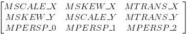
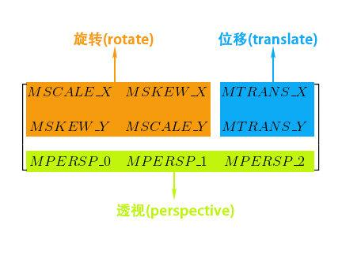

+++
title = '[Android开发]使用Matrix进行坐标变换'
date = 2025-10-16T21:34:10+08:00
draft = false
slug = 'android-matrix'
description ='在Android使用Matrix来转换坐标'
keywords =['android','matrix']
+++

在前面的文章([https://www.lsz.sc.cn/posts/android-camerax/](https://www.lsz.sc.cn/posts/android-camerax/))中，我们是在视频信息的上面又放置了一层，用来绘制目标框，主要用来框出视频中人脸所在的位置。但在前面，我们只是简单的画了一个框，实际的应用要复杂一些。

在实际中，我们在进行目标检测的时候，传入的图片是摄像头原始的图片大小，所以目标检测方法得到的也是基于原始图片的人脸框的位置，我们如果根据原始图片中人脸的位置来绘制目标框，则肯定会是一个错误的位置。

<!--more-->

基于上面的信息，我们知道，人脸框位置错误的原因是为在实际原始的图片大小于屏幕上显示的图片大小不一致，导致位置错误，那我们有两钟方式来解决这个问题。

# 一、直接在图片上画框

这是最直接的方式。在前面，我们通过```ImageAnalysis```来检测人脸的位置，我们同样可以对原始的检测图片进行处理，在图片上添加人脸框以及相关的```label```信息，再将画了框的图片输出到屏幕上，由系统底层完成图片的缩放。

因为框已经画在原始图片上了，系统在缩放显示的时候，框的位置也跟着变化。

# 二、坐标变换

基于坐标变换的话，我们就还是使用原来的方案，在视频上覆盖一个画布，用于实时绘制人脸框。只是在绘制的时候，需要将坐标变换为画布的坐标。

变换的算法可以我们自己去实现，但没必要，这里就使用我们上面说到的```Matrix```类来实现。


我们使用的是Android图形库中的```android.graphics.Matrix```，其主要作用就是用来实现坐标变换。

大概是下面的样子：



其中每个字段的含义如下：

* MSCALE_X、MSCALE_Y：控制缩放
* MTRANS_X、MTRANS_Y：控制平移
* MSKEW_X、MSKEW_X：控制错切
* MSCALE_X、MSCALE_Y、MSKEW_X、MSKEW_X：控制旋转
* MPERSP_0、MPERSP_1、MPERSP_2：控制透视

如下图的结构：



当然，我们不会在这里做深入的介绍，只仅仅需要完成我们的目标，将图片上人脸框的坐标变换为适合屏幕上显示的信息的坐标信息。

在```Matrix```类中，提供了实例方法```public boolean mapRect(RectF dst,RectF src)```和```public boolean mapRect(RectF rect)```，都是用于坐标变换，区别仅仅是坐标源坐标的输入位置不同。

我们的完整变换函数入下：

```java
public RectF Transform(RectF box) {
    RectF onScreenRect = new RectF(box);
    assert matrix != null;
    matrix.mapRect(onScreenRect);
    return onScreenRect;
}
```

我们这里的```matrix```是通过前面文章中的```previewView.getSensorToViewTransform()```获得的。

到这里，我们就可以使用新的坐标来绘制人脸框。

如果你想要了解为什么可以使用```mapRect```来变换坐标，你需要去了解```Matrix```的变换原理。
