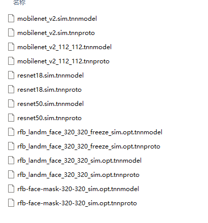
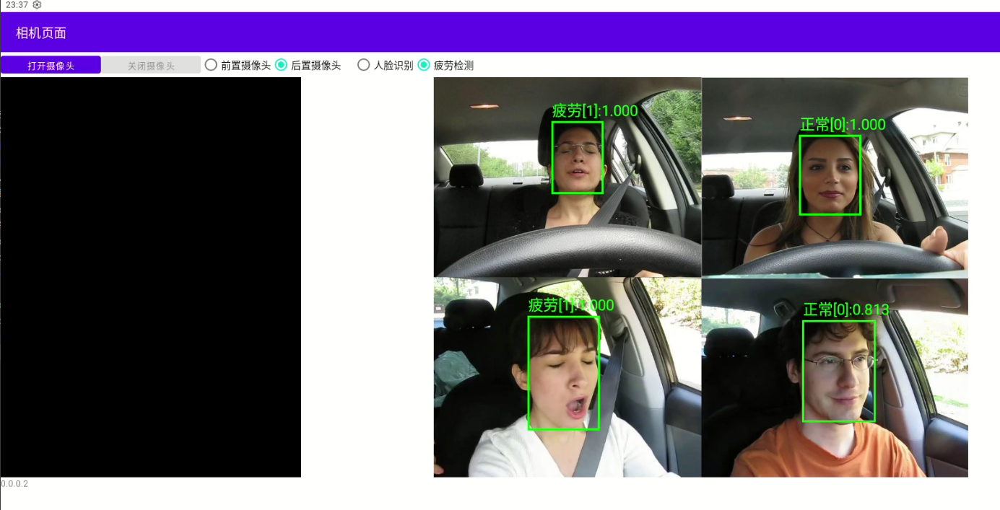

+++
title = '[Android开发]疲劳驾驶'
date = 2025-10-20T21:43:50+08:00
draft = true
slug = 'drowsy'
cover = './image.png'
keywords = ['android','drowsy','疲劳驾驶']
description = '在本文中，我们将基于Android实现疲劳驾驶。'
+++

在疲劳驾驶和人脸识别中，首先要做的一个步骤都是人脸检测，就是从一张图片中，准确找到人脸所在的位置，然后，我们再用找到的人脸图像去进行识别和疲劳检测。

对于不同的任务，我们将使用不同的模型去完成。

在疲劳驾驶中，我们使用了以下两个模型：

* rfb-face-mask-320-320_sim - 检测模型，用于在图像中检测出人脸的位置
* mobilenet_v2_112_112 - 识别模型，用于识别检测出的人脸是否属于疲劳状态

我们提供了基于C++的JNI接口包，你可以直接导入到你的系统中进行使用。下面，我们将在前篇（[摄像头使用](/posts/android-camerax/)）的基础上，一步一步完成疲劳驾驶功能的开。

<!--more-->

# SDK安装

将我们提供的C++代码库复制到目录```/app/src/main/cpp/NN```中，代码中提供的JNI函数所匹配的包名为```com.example.demo.NN```，你需要修改为匹配你的项目的名称。

在SDK包中，我们集成了腾讯公司开源的```TNN```神经网络推理框架，开源地址为：

[https://github.com/Tencent/TNN/](https://github.com/Tencent/TNN/)

> 对于神经网络的相关知识，感兴趣的话可以进行系统的学习。

在SDK中，有以下两个文件配置了模型的相关超参数：

* classification.h - 配置了分类模型的超参数
* object_detection.h - 配置了目标检测模型的超参数

# 模型安装

在SDK中，我们没有集成模型文件，你需要将我们需要的模型文件复制到```assets```文件夹中，我们这里的路径为：```/app/src/main/assets/tnn-models/```。

这里和语音识别一样，都需要在加载模型前，将相应的模型文件释放到存储中。

> 在```TNN```中，模型包含```tnnmodel```和```tnnproto```两个文件，在复制的时候请确保完整。



如上图所示，我们提供多个模型，其中也包含了后面人脸识别需要用到的模型。

同时，我们将提供静态的测试图片，用于功能测试。测试图片我们在演示程序中打包放入到了文件夹```/app/src/main/assets/images/```中。

# UI设计

我们将在前篇中的相机页面中，添加完成疲劳驾驶与人脸识别的功能，并同时开启前后摄像头的选择功能。

> 布局文件的编写方法与以前介绍的一致，本文不再做详细介绍，本文中仅简单描述修改的内容。

最终，我们的UI将如下图：



**1. 摄像头选择**

使用```RadioGroup```与```RadioButton```完成前后摄像头选择功能布局。

在合适的位置添加如下的布局代码：

```xml
<RadioGroup
    android:layout_width="wrap_content"
    android:layout_height="wrap_content"
    android:orientation="horizontal"
    android:id="@+id/useCameraGroup"
    >
    <RadioButton
        android:id="@+id/useCameraFront"
        android:layout_width="wrap_content"
        android:layout_height="wrap_content"
        android:text="前置摄像头"
        android:textSize="16sp" />

    <RadioButton
        android:id="@+id/useCameraBack"
        android:layout_width="wrap_content"
        android:layout_height="wrap_content"
        android:text="后置摄像头"
        android:checked="true"  android:textSize="16sp" />
</RadioGroup>
```

**2. 功能选择**

我们需要完成疲劳驾驶与人脸识别功能，在合适的位置添加如下代码：

```xml
<RadioGroup
    android:layout_width="wrap_content"
    android:layout_height="wrap_content"
    android:orientation="horizontal"
    android:id="@+id/useFunctionGroup"
    >
    <RadioButton
        android:id="@+id/useFunctionFace"
        android:layout_width="wrap_content"
        android:layout_height="wrap_content"
        android:text="人脸识别"
        android:textSize="16sp" />

    <RadioButton
        android:id="@+id/useFunctionDrowsy"
        android:layout_width="wrap_content"
        android:layout_height="wrap_content"
        android:text="疲劳检测"
        android:checked="true"  android:textSize="16sp" />
</RadioGroup>
```

**3. 显示测试图片**

为了便于查看效果，我们再在UI上添加一个测试图片的结果展示。在摄像头画面的后面添加如下布局代码：

```xml
<FrameLayout
    android:layout_width="wrap_content"
    android:layout_height="wrap_content">
    <ImageView
        android:layout_width="wrap_content"
        android:layout_height="wrap_content"
        android:id="@+id/viewImager"
        />
    <com.example.demo.DrawView
        android:layout_width="match_parent"
        android:layout_height="match_parent"
        android:id="@+id/viewImageBoxer"
        />
</FrameLayout>
```

这里，我们使用了```FrameLayout```来包裹```ImageView```以及我们自定义的```com.example.demo.DrawView```。

> com.example.demo.DrawView根据模型返回的数据来在屏幕上添加目标框以及相关信息的显示。