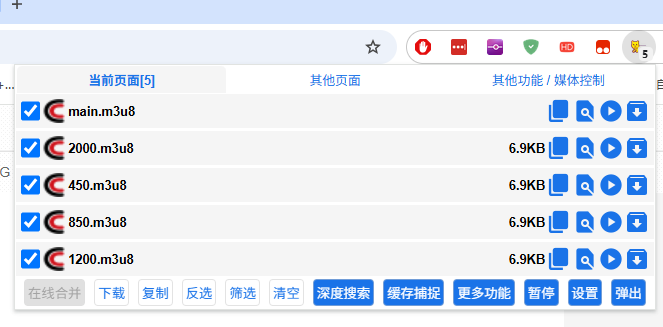
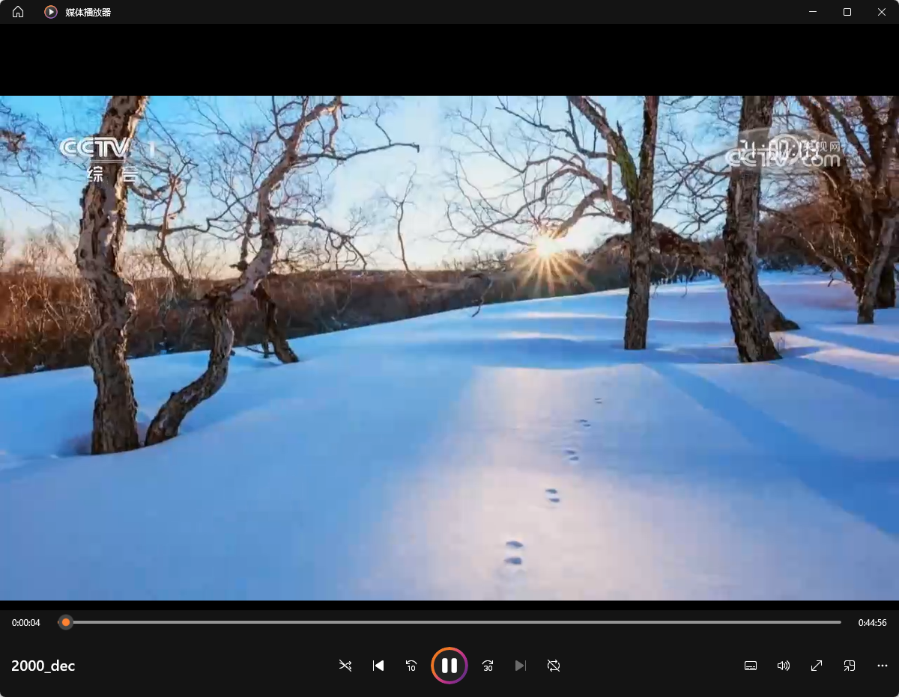

+++
title = '央视网视频下载及花屏修复'
date = 2025-10-24T23:52:41+08:00
draft = false
slug = 'cctv-down'
keywords = ['CCTV','视频下载','花屏','cctv-decrypt']
description = '下载CCTV央视网的视频，修复花屏问题'
+++

CCTV央视网的视频在网页上观看的时候能正常播放，但能过工具下载后播放，视频会出现花屏。就像下图这样：


下面，我们将从下载到修复花屏一起介绍。

<!--more-->

# 下载

首先，我们找到一个需要下载的视频URL，如：https://eco.cctv.com/2025/08/18/ARTIwIe6PRGCnYRTJZnQRbth250818.shtml

视频下载的工具有很多，我这里使用的是浏览器扩展**猫抓**。谷歌商店的地址是：https://chromewebstore.google.com/detail/%E7%8C%AB%E6%8A%93/jfedfbgedapdagkghmgibemcoggfppbb?hl=zh-CN&utm_source=ext_sidebar

安装后，将扩展固定在浏览器上。


这个时候，我们打开需要下载的视频的播放页面。可以看到猫抓为我们嗅探到了5个视频，点开猫抓图标。



可以看到，视频地址是一个```m3u8```文件。后面分别有复制、解析、预览、解析、下载等按钮。点击预览可以看到是不是我们想要下载的视频文件。

在这里，每个地址对应了不同的清晰度。选择想要的清晰度进行下载。

> 默认情况下，猫抓会打开下载工具进行下载，如果你没有设置下载工具，可以选择解析。

选择**解析**后，猫抓会在新的标签中显示m3u8文件中的所有切片。


在最下面，勾选**mp4格式**，然后点击**合并下载**，猫抓就会开始下载所有的切片，并将切片文件合并为**mp4**格式的视频文件。我这里下载下来后保存为**2000.mp4**。

到这里还没完，这个直接下载的文件，你如果打开播放的话会发现是图像是花屏的，音频没有问题。

# 修复花屏

修复花屏需要用到工具```cctv-decrypt```，这个工具可以将花屏的视频修复为正常视频。

将下载的cctv-decrypt解压后，可以在cctv-decrypt目录下找到```batch_cbox.bat```和```cbox.exe```，cbox.exe是实际修复花屏需要的程序，batch_cbox.bat可以批量将当前目录下的mp4文件全部修复。为了文件，我们将前面下载的2000.mp4复制到cctv-decrypt目录下，然后运行```batch_cbox.bat```。


根据提示，可以发现已经修复了下载的视频文件。在相同目录下生成了```2000_dec.mp4```文件，尝试播放一下。



视频已经可以正常播放。

---

> 当然，你也可以使用其它工具进行下载，下载后，使用cctv-decrypt进行修复即可。

> 注意:cbox的路径中不能有中文（修复的视频文件也不能有中文路径），建议保存路径直接设置为英文，或者下载后统一复制到某个纯英文的文件夹。

# 下载地址

链接: https://pan.baidu.com/s/1rsJya6ZWfF2huRz7iVKOGA?pwd=nw5n 提取码: nw5n 

