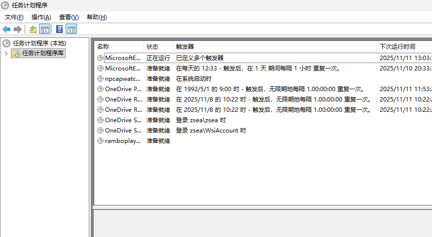
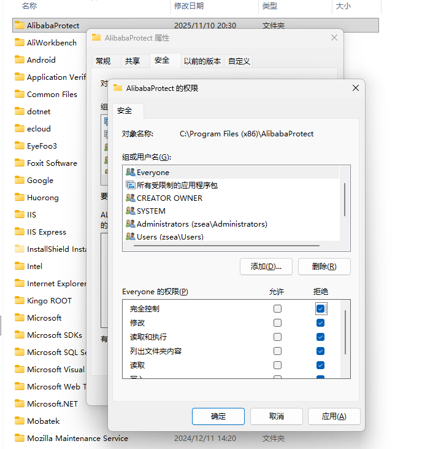

+++
title = '干掉AlibabaProtect.exe和Alibaba PC Safe Service'
date = 2025-11-10T20:03:05+08:00
draft = false
slug = 'kill-alibabaprotect'
cover ='./image-3.png'
keywords =['AlibabaProtect', '删除AlibabaProtect', '禁用AlibabaProtect', 'Alibaba PC Safe Service', '千牛', '流氓软件', '计划任务', '系统服务', '进程结束', '文件夹权限']
description = '本文提供了彻底禁用和删除千牛软件附带的AlibabaProtect.exe及Alibaba PC Safe Service的详细步骤。指南包含删除计划任务、清除系统服务、结束顽固进程以及通过设置文件夹权限防止其重新安装，帮助用户解决软件崩溃、资源占用及隐私安全问题。'
+++

在使用旧版的千牛时，经常出现软件无故崩溃。经过分析，发现是```AlibabaProtect```捣的鬼，这个时候，我们需要禁用掉```AlibabaProtect```。


> AlibabaProtect是阿里巴巴的全家桶插件,此进程不仅会占用大量内存和cpu性能，会在后台悄悄的监控你的上网过程，还在后台监控你的一举一动，然后给你精准推送广告,所以它不仅仅是一个文件,还是一个恶意软件。而且Alibabaprotect非常难删除，删掉后重启电脑又会自动出现,是一个名副其实的流氓软件。

你可以按照本文的步骤一步一步来禁用掉```AlibabaProtect```。

<!--more-->


# 删除计划任务

```AlibabaProtect```会添加计划任务来升级和保护自己。按以下步骤删除相关计划。

1. 打开[任务计划程序]。
2. 在左侧选择[任务计划程序(本地)] > [任务计划程序库]。
3. 删除右侧列表中以**Ali**开头的计划任务。



在上图中，我已经删除了相关的计划任务。

# 删除系统服务

```AlibabaProtect```会将自己添加到系统服务中，以达到自动启动的目的。删除步骤如下：

1. 以管理员身份打开命令窗口。
2. 执行命令```sc delete AlibabaProtect```。

到这里，我们已经成功删除了```AlibabaProtect```开机启动服务，可以自己在[服务]中确认。

# 停止AlibabaProtect.exe进程

我们如果直接在进程中结束```AlibabaProtect.exe```是无法成功的。


这里，有两种方式可以选择：

1. 直接重启电脑。
2. 任务管理器——性能——打开资源监视器——CPU——关联的句柄，搜索alibaba, 右键停止进程

以上两种方式任选一种操作成功后，就可以删除```AlibabaProtect```的相关文件了。你需要删除```C:\Program Files (x86)\AlibabaProtect```目录。

# 禁止AlibabaProtect目录的访问

到上面的步骤，我们已经删除了```AlibabaProtect```服务，但是我们一但再次运行千牛，```AlibabaProtect```就还会被安装上，按以下步骤，可以禁止掉```AlibabaProtect```的安装：

1. 在```C:\Program Files (x86)\```下新建目录```AlibabaProtect```
2. 修改角色```Everyone```的权限为拒绝，如下图。



# 最后

如果看了上面的文章还是不会操作，可以联系我获取一键禁用的脚本。

V:lsjx_on


