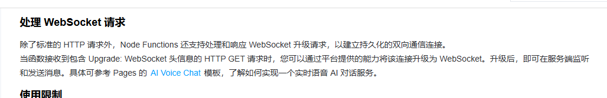
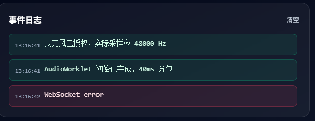
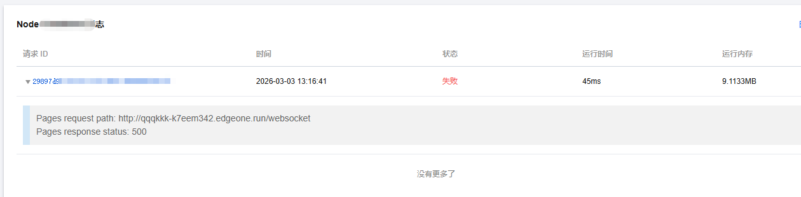
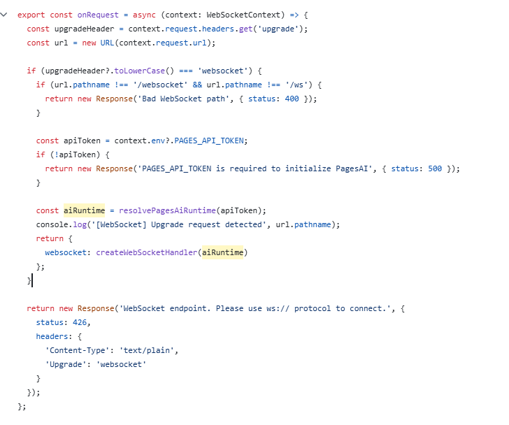
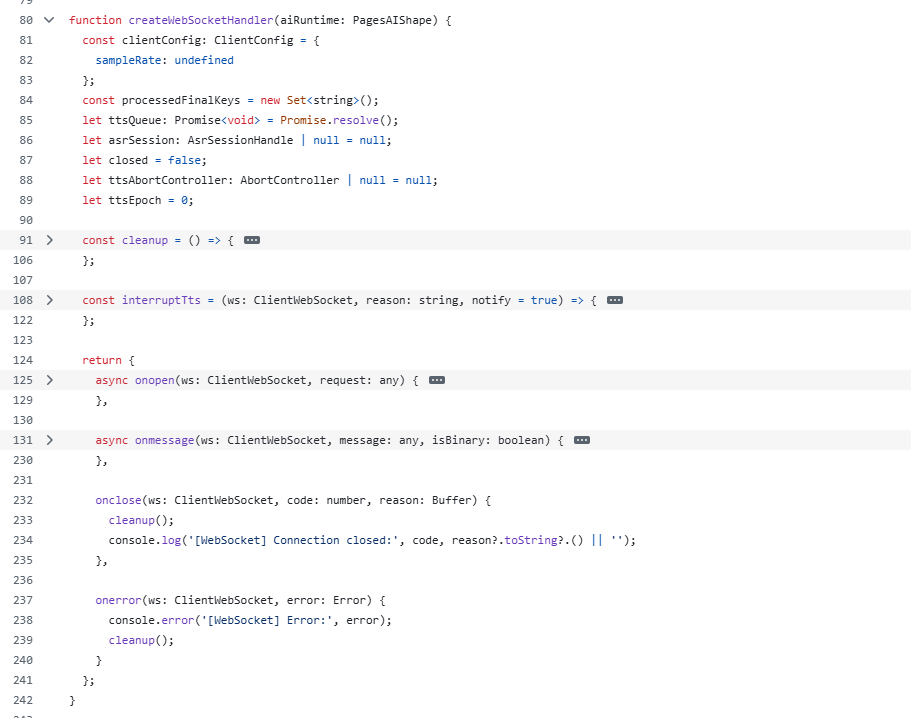
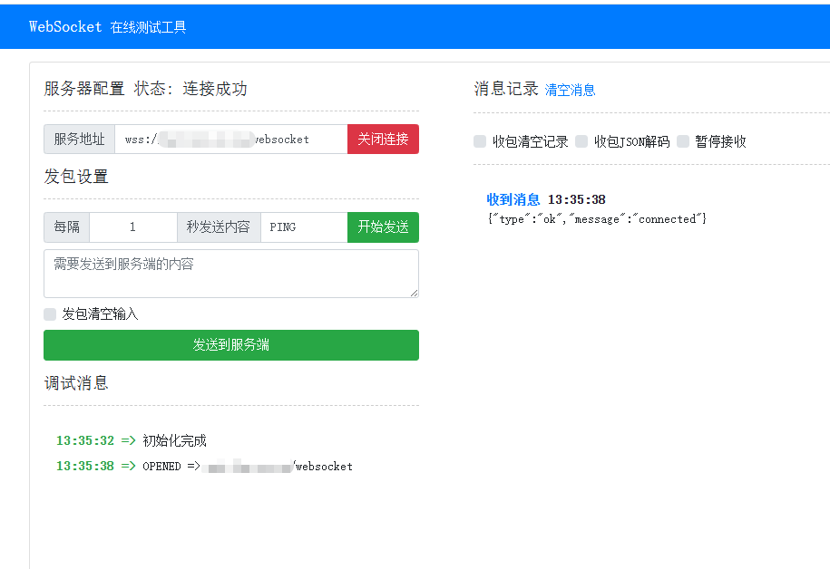

+++
title = '在EdgeOne Pages平台中使用Websocket'
date = 2026-03-03T12:59:02+08:00
draft = false
+++

> EdgeOne Pages 是基于 Tencent EdgeOne 基础设施打造的全栈开发部署平台，提供从前端页面到动态 API 的无服务器部署体验，适用于构建营销网站、AI 应用等现代 Web 项目。通过边缘网络全球加速，确保应用获得快速、稳定的访问体验。

去年搞了一个EO的免费版，使用上还挺好的。最近想在上面部署一个Websocket的服务，记录一下踩过的坑。

<!--more-->

根据EO的文档，Pages是支持Websocket的，但是文档写得比较简单，只是叫看示例模板。



# 失败部署

本人第一次部署是直接将示例下载后，通过文件上传的方式进行的部署。这个部署直接就是Websocket错误。



查看日志，也只有一个500错误，也看不出来错误在哪里。


> 在Github上，也有人提出同样的问题。

后来给官方联系，官方直接通过模板部署就一切正常。我尝试通过模板部署也一切正常。

# 最终解决

经过与官方沟通，可以确定的是当前的版本是能正常支持Websocket的，接下来，我们就查要将官方复杂的示例提取出简单的步骤。

在官方示例中，我们主要分析```node-functions/websocket.ts```文件。

在该文件中，有很多其它与Websocket无关的代码，我们忽略掉，主要分析他的导出函数。


在导出函数的前面，主要判断了是否是一个Websocket请求，如果是的话，就返回一个Object。
```js
{
    websocket:{}
}
```

如果不是websocket，则正常返回一个```Response```，提示这是一个Websocket服务。

接下来，我们再看看一个```websocket```属性是什么样的。 

在上面的```onRequest```中，websocket属性是由```createWebSocketHandler```创建的，再看看```createWebSocketHandler```的内容。


同样，只需要关注最后返回的对象。在最后，返回的对象包含以下四个方法：
* onopen(ws, request)
* onmessage(ws, message, isBinary)
* onclose(ws, code, reason)
* onerror(ws, error)

分析完成后，我们自己实现一个简单的Websocket服务。

```javascript
export const onRequest = async (context) => {
    const upgradeHeader = context.request.headers.get('upgrade');
    const url = new URL(context.request.url);

    if (upgradeHeader?.toLowerCase() === 'websocket') {
        if (url.pathname !== '/websocket' && url.pathname !== '/ws') {
            return new Response('Bad WebSocket path', { status: 400 });
        }

        console.log('[WebSocket] Upgrade request detected', url.pathname);
        return {
            websocket: {
                async onopen(ws, request) {
                    ws.send(JSON.stringify({ type: 'ok', message: 'connected' }));
                },

                async onmessage(ws, message, isBinary) {
                },

                onclose(ws, code, reason) {

                    console.log('[WebSocket] Connection closed:', code, reason?.toString?.() || '');
                },

                onerror(ws, error) {
                    console.error('[WebSocket] Error:', error);

                }
            }
        };
    }

    return new Response('WebSocket endpoint. Please use ws:// protocol to connect.', {
        status: 426,
        headers: {
            'Content-Type': 'text/plain',
            'Upgrade': 'websocket'
        }
    });

}
```

完成后，我们部署测试一下。


可以看到，Websocket运行成功。

> 其实我也好奇，为什么官方的示例下载部署就不能运行WebSocket，但是直接用模板就不行。

# 其它 

1. 目前，Websocket仅支持在```Node Functions```中运行，据说，官方有计划在```Edge Functions```中也支持。
2. ```Node Functions```的运行时长默认是30s，但最大可以配置为120s,配置详见文档：[https://pages.edgeone.ai/zh/document/edgeone-json#d0ee4b9d-4b79-4e04-89a9-bfc72868ca1a](https://pages.edgeone.ai/zh/document/edgeone-json#d0ee4b9d-4b79-4e04-89a9-bfc72868ca1a)
3. 当前```Pages```不支持IPv6，部署在Pages中的服务，也不支持访问IPv6环境下的HTTP API。
4. 在```edgeone cli```中目前不支持Websocket。
5. 这一点比较重要，如果我们需要使用Websocket，需要在我们的项目文件中添加```package.json```文件，并添加```ws```的依赖包。