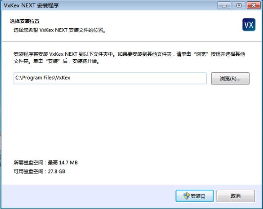
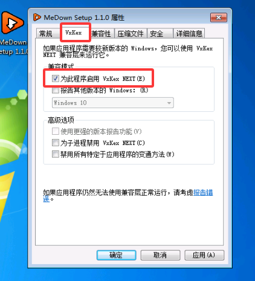
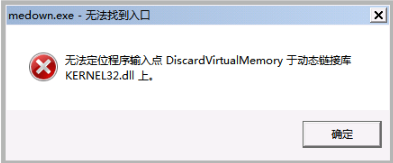

+++
title = '在Win7下能使用米当吗？答案是：能！'
date = 2026-06-15T23:32:18+08:00
draft = false
slug = 'medown-win7'
cover = "./image.png"
keywords =['medown', '米当', '视频下载', 'Win7','windows 7', '正常使用','兼容']
description = '解决在Win7下使用米当的需求，同时，该方法适用其它软件的兼容需求。'
+++

**米当**是一款由```Electron```开发的通用Web视频下载软件，常用于下载各类网站上的视频内容。常见支持的网站有：央视视频、哔哩哔哩、抖音视频、YouTuBe、公众号视频等，主打一个能看就能下。
软件下载地址：[https://medown.lsz.sc.cn/](https://medown.lsz.sc.cn/)。

但是，众所周知，```Electron```已经不再支持```Win7```系统，所以**米当**在正常情况下也是无法支持```win7```的。

再但是，今天就非要给大家介绍一个让**米当**支持```Win7```的方法。

<!--more-->

# VxKex-NEXT

今天的主角是```VxKex-NEXT```，是一套适用于 Windows 7 的 API 扩展，可让一些 Windows 8、8.1 和 10 独占应用程序在 Windows 7 上运行。

有了它，就可以让那些不能在 Windows 7 上运行的软件正常运行，我们的**米当**也在支持之列。

> ```VxKex-NEXT```是一个开源软件，你如果对它感觉兴趣，可以参考他的源代码：[https://github.com/YuZhouRen86/VxKex-NEXT](https://github.com/YuZhouRen86/VxKex-NEXT)。

## 下载

```VxKex-NEXT```托管在Github上，其下载地址是：[https://github.com/YuZhouRen86/VxKex-NEXT/releases](https://github.com/YuZhouRen86/VxKex-NEXT/releases)。

如果你无法访问该网站，也可以通过以下网盘地址下载：

百度网盘：[https://pan.baidu.com/s/1_RQHUo5tN5FOs-3iY-MPdQ?pwd=ugzz](https://pan.baidu.com/s/1_RQHUo5tN5FOs-3iY-MPdQ?pwd=ugzz) 提取码: ugzz

## 安装

运行安装程序，所有选项按默认值，直接点击安装即可。



安装前建议执行以下操作：

* 卸载
    * 0patch Agent - 它可能导致基于 Chromium 的浏览器和 JetBrains IDE 在启用 VxKex NEXT 并运行后崩溃。
* 更新
    * MacType - 需要更新到```2025.6.9```以上版本，旧版 MacType 可能导致所有程序在启用 VxKex NEXT 后无法启动。

## 使用

> 使用前，假设你已经下载好了**米当**安装程序。

有***两种***使用方式：

1. 右键单击**米当**安装程序，打开属性对话框，选择“VxKex”选项卡。然后，选中“为此程序启用 VxKex NEXT”复选框，并尝试运行程序。
    
2. 从开始菜单中找到```VxKex NEXT Global Settings```并打开，点击```添加```按钮，选择**米当**安装程序，点击```打开```按钮，并尝试运行程序。    

> 上面两种使用方式任选一种即可。

设置好后，安装程序即可正常运行。

**同样，在安装完成后的米当软件上，也需要启用```VxKex NEXT```。**

如果没有启用```VxKex NEXT```，软件会出下以下错误：

