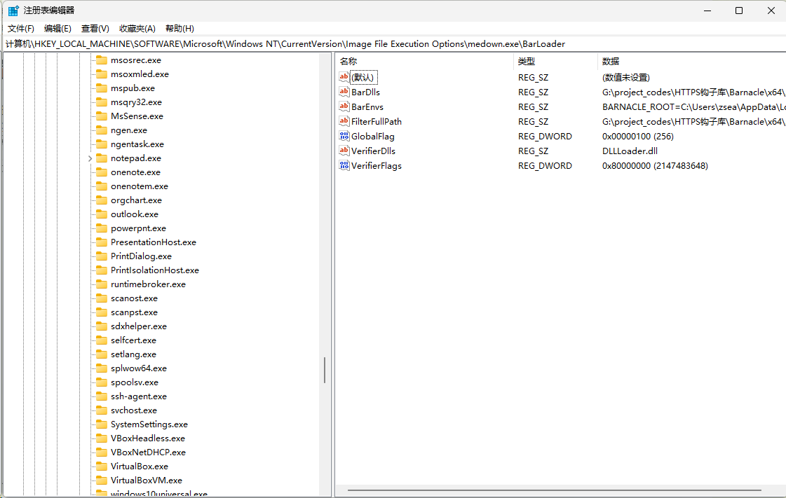

+++
title = '将DLL做为验证器注入到应用程序中'
date = 2026-07-08T22:53:57+08:00
draft = false
slug = 'application-verifier'
keywords =['DLL注入', 'Application Verifier', '应用验证器', 'DLL Injection','HOOK系统API']
description = '通过应用验证器完成DLL注入，先于main函数执行。'
+++

> 这是我在研究```VxKex```时发现的注入方式，网上的资料很少，在AI给出的资料中还有错误，弄得我也是搞了好久才整明白。

在```Windows```系统中，DLL注入一直是一门应用非常广泛的技术（姑且不讨论大多数应用场景的合法性）。目前主流的注入方式主要有以下几种：
* ```CreateRemoteThread```远程注入
* ```QueueUserAPC```注入
* ```SetWindowsHookEx```注入

以上注入方式有一个共同点，都是针对**进程**进行注入，即你注入的DLL一定是在进程创建之后的。

在这里，将介绍一种应用程序验证器的注入方式。这是一种在应用程序早期注入的方式，这种方式的注入，可以让你尽可能早的```HOOk```到系统函数。

<!--more-->
**应用程序验证器**是一个DLL，但是它的加载非常早，早到仅次于```ntdll```。同时，验证器本身还提供```HOOK```的方式，不需要依赖第三方库就可以完成系统函数的```HOOK```。

操作系统在加载应用程序的时候，会检查注册表中应用程序是否有对应的验证器配置，如果有，就加载验证器DLL。所以说，验证器DLL的加载是由操作系统来完成的，几乎不会被其它软件阻止。

# 配置验证器

在注册表```HKEY_LOCAL_MACHINE\SOFTWARE\Microsoft\Windows NT\CurrentVersion\Image File Execution Options```下，有多个以应用程序名称命名的项，每个项就是一个应用程序的配置。


在这里，有两个必要的键需要配置：
* GlobalFlag。设置为```0x100```，表示启用应用程序验证器。
* VerifierDlls。验证器列表，多个验证器之间用``` ```（空格）分隔。注意，这里只填DLL的名称，DLL的路径需要放到```C:\Windows\System32```目录下，这就需要安装的时候提供管理员权限。如果你是在64位系统下注入到一个32位的应用程序中，验证器也需要是32的，放于```C:\Windows\SysWOW64```目录中。
* VerifierFlags。用于验证器的功能，默认情况下，验证器会多项内存检查，严重影响性能，设置为```0x80000000```可以最大程度减少性能影响。

> 我在修改```VerifierDlls```项的时候，就遇到了杀毒软件拦截。

到这里，如果你的DLL只是一个普通的DLL，那应用程序在启动的时候将出出现闪退、报错等问题不能启动。

## 配置具体的应用程序

在上图中，如果直接在```medown.exe```下进行配置，则所有名称为```medown.exe```的程序都会受到影响，如果要注入到指定路径的应用程序中，可以在```medown.exe```项下建立子项，子项的名称可以自己随意取。

**具体步骤如下：**

1. 在```medown.exe```项下，建立名称为```UseFilter```，类型为```REG_DWORD```，值为```1```的注册表键，表示开始过滤。
2. 在```medown.exe```项下建立子项，在子项目中按上面的描述建立```GlobalFlag```和```VerifierDlls```键。
3. 在新建的子项中，新建一个名称为```FilterFullPath```，类型为```REG_SZ```，值为应用程序详细路径的键。

通过上面的配置，就只有指定位置的程序会加载验证器了。

# 验证器代码框架

和普通DLL一样，验证器也是以```DllMain(HMODULE hModule,DWORD  ul_reason_for_call,LPVOID lpReserved)```为入口。在普通DLL中，```ul_reason_for_call```的值只有以下四个：
* DLL_PROCESS_ATTACH(1)
* DLL_THREAD_ATTACH(2)
* DLL_THREAD_DETACH(3)
* DLL_PROCESS_DETACH(0)

> 这几个值的含义不在这里讨论。

在验证器中，还会传入另一个值```DLL_PROCESS_VERIFIER(4)```，在这个值中，```lpReserved```不再仅用做保留，而需要返回一个特殊的数据结构。

```c++
#define DLL_PROCESS_VERIFIER 4

BOOL APIENTRY DllMain( HMODULE hModule,
                       DWORD  ul_reason_for_call,
                       LPVOID lpReserved
                     )
{
    switch (ul_reason_for_call)
    {
    case DLL_PROCESS_ATTACH:
		break;
    case DLL_THREAD_ATTACH:
    case DLL_THREAD_DETACH:
    case DLL_PROCESS_DETACH:
        break;
	case DLL_PROCESS_VERIFIER:
        InitVerifier();
        *(void**)lpReserved = &g_verifierDesc;
		break;
    }
    
    return TRUE;
}
```

在```DLL_PROCESS_VERIFIER```分支中，调用```InitVerifier()```初始化了一个全局的结构，并将指针放于```lpReserved```中。

不过要注意，在```DLL_PROCESS_VERIFIER```中，由于仅加载了```ntdll```，很多功能都还不能使用，一般只初始化```RTL_VERIFIER_PROVIDER_DESCRIPTOR```即可。

## RTL_VERIFIER_PROVIDER_DESCRIPTOR结构

> 关于```RTL_VERIFIER_PROVIDER_DESCRIPTOR```没有查到正式的公开文档，这里的结构是参考```ReactOS```中的代码。我将相关的结构放到```verifier_def.h```中。

```c++
#pragma once
#include <Windows.h>
#define DLL_PROCESS_VERIFIER 4

typedef VOID(NTAPI* RTL_VERIFIER_DLL_LOAD_CALLBACK) (PWSTR DllName, PVOID DllBase, SIZE_T DllSize, PVOID Reserved);
typedef VOID(NTAPI* RTL_VERIFIER_DLL_UNLOAD_CALLBACK) (PWSTR DllName, PVOID DllBase, SIZE_T DllSize, PVOID Reserved);
typedef VOID(NTAPI* RTL_VERIFIER_NTDLLHEAPFREE_CALLBACK) (PVOID AllocationBase, SIZE_T AllocationSize);

// 需要HOOK的函数
typedef DWORD(WINAPI* PFN_BaseThreadInitThunk)(DWORD Hooked, LPTHREAD_START_ROUTINE StartAddress, PVOID Parameter);

typedef struct _RTL_VERIFIER_THUNK_DESCRIPTOR {
    PCHAR ThunkName;
    PVOID ThunkOldAddress;
    PVOID ThunkNewAddress;
} RTL_VERIFIER_THUNK_DESCRIPTOR, * PRTL_VERIFIER_THUNK_DESCRIPTOR;

typedef struct _RTL_VERIFIER_DLL_DESCRIPTOR {
    PWCHAR DllName;
    DWORD DllFlags;
    PVOID DllAddress;
    PRTL_VERIFIER_THUNK_DESCRIPTOR DllThunks;
} RTL_VERIFIER_DLL_DESCRIPTOR, * PRTL_VERIFIER_DLL_DESCRIPTOR;

typedef struct _RTL_VERIFIER_PROVIDER_DESCRIPTOR {
    // Provider fields
    DWORD Length;
    PRTL_VERIFIER_DLL_DESCRIPTOR ProviderDlls;
    RTL_VERIFIER_DLL_LOAD_CALLBACK ProviderDllLoadCallback;
    RTL_VERIFIER_DLL_UNLOAD_CALLBACK ProviderDllUnloadCallback;

    // Verifier fields
    PWSTR VerifierImage;
    DWORD VerifierFlags;
    DWORD VerifierDebug;
    PVOID RtlpGetStackTraceAddress;
    PVOID RtlpDebugPageHeapCreate;
    PVOID RtlpDebugPageHeapDestroy;

    // Provider field
    RTL_VERIFIER_NTDLLHEAPFREE_CALLBACK ProviderNtdllHeapFreeCallback;
} RTL_VERIFIER_PROVIDER_DESCRIPTOR, * PRTL_VERIFIER_PROVIDER_DESCRIPTOR;
```

其中```RTL_VERIFIER_THUNK_DESCRIPTOR```和```RTL_VERIFIER_DLL_DESCRIPTOR```是用于```HOOK```的结构，只需要按说明填写，验证器就可以自动完成对指定函数的```HOOK```。

我们接着说```InitVerifier()```函数，在这个函数里，填充了一个```RTL_VERIFIER_PROVIDER_DESCRIPTOR```。

```c++
static RTL_VERIFIER_PROVIDER_DESCRIPTOR g_verifierDesc = {0};

static RTL_VERIFIER_DLL_DESCRIPTOR emptyDlls[] = {
    { nullptr, 0, nullptr, nullptr }
};

void NTAPI DLLLoad(PWSTR DllName, PVOID DllBase, SIZE_T DllSize, PVOID Reserved) {

}
void NTAPI DLLUnLoad(PWSTR DllName, PVOID DllBase, SIZE_T DllSize, PVOID Reserved) {

}
void NTAPI DLLNTHeapFree(PVOID AllocationBase, SIZE_T AllocationSize) {
}
RTL_VERIFIER_PROVIDER_DESCRIPTOR* InitVerifier() {
    // Inside DLL_VERIFIER:
    g_verifierDesc.Length = sizeof(RTL_VERIFIER_PROVIDER_DESCRIPTOR);
    g_verifierDesc.ProviderDlls = emptyDlls;
    g_verifierDesc.ProviderDllLoadCallback = DLLLoad;
    g_verifierDesc.ProviderDllUnloadCallback = DLLUnLoad;
	g_verifierDesc.ProviderNtdllHeapFreeCallback = DLLNTHeapFree;
	return &g_verifierDesc;
}
```

在这里，```emptyDlls```以一个空的结构结束，表示不需要```HOOK```任何东西。将这个空的DLL编译并安装到注册表中，再启动应用程序，就可以在应用程序的模块中看到这个DLL。

# HOOK功能的实现

在前面已说明，要HOOK只需要填充```RTL_VERIFIER_THUNK_DESCRIPTOR```和```RTL_VERIFIER_DLL_DESCRIPTOR```即可。

**RTL_VERIFIER_THUNK_DESCRIPTOR结构说明**

```RTL_VERIFIER_THUNK_DESCRIPTOR```有三个字段，用于描述HOOK相关的函数信息

* ThunkName - 需要HOOK的函数名称，这个函数必须是DLL中的导出函数。
* ThunkOldAddress - 在HOOK成功后，系统会将旧的函数地址填入这里。你自己的函数中，可以通过这个地址调用原始的函数。
* ThunkNewAddress - 你自己写的函数，用于替代原始的函数。

**RTL_VERIFIER_DLL_DESCRIPTOR结构说明**

```RTL_VERIFIER_DLL_DESCRIPTOR```用于描述需要HOOK的DLL的信息，当然，也通过相关字段关联了前面的HOOK的函数。

* DllName - 需要HOOK的DLL的名称，如：kernel32.dll。**注意：必须包括扩展名。**
* DllFlags- 设置为```0```即可。
* DllAddress - DLL的地址，由系统处理，填```NULL```即可。
* DllThunks - 当前DLL中需要HOOK的函数信息，最后一条记录必须所有字段都是```0```。

下面的示例，用于HOOK```kernel32.dll```中的```VirtualAlloc```函数。

```c++
// Forward declaration
LPVOID WINAPI HookVirtualAlloc(LPVOID lpAddress, SIZE_T dwSize, DWORD flAllocationType, DWORD flProtect) {
    static const auto originalFn = (decltype(&VirtualAlloc))g_funcs[0].ThunkOldAddress;

    auto msg = std::format("VirtualAlloc: tid={} size={} type={:#x} prot={:#x} lp={}\n",
        GetCurrentThreadId(), dwSize, flAllocationType, flProtect, lpAddress);
    OutputDebugStringA(msg.c_str());

    LPVOID result = originalFn(lpAddress, dwSize, flAllocationType, flProtect);

    auto msg2 = std::format("VirtualAlloc result: {}\n", result);
    OutputDebugStringA(msg2.c_str());

    return result;
}

static RTL_VERIFIER_THUNK_DESCRIPTOR g_funcs[] = {
    { (LPSTR)"VirtualAlloc", nullptr, HookVirtualAlloc },
    { nullptr, 0, nullptr }  // sentinel
};

static RTL_VERIFIER_DLL_DESCRIPTOR g_dlls[] = {
    { (PWSTR)L"kernel32.dll", 0, nullptr, g_funcs },
    { nullptr, 0, nullptr, nullptr }  // sentinel
};
```

> 如果要HOOK多个函数，则在```g_funcs```中继续添加即可。

将前面```g_verifierDesc.ProviderDlls```的值改为当前的```g_dlls```即可完成HOOK。

# 补充

> 补充的内容都是通过实测出来的，没有找到文档说明。

1. ```DLL_PROCESS_VERIFIER```优先于```DLL_PROCESS_ATTACH```执行，在```DLL_PROCESS_VERIFIER```中，我甚至不能调用```OutputDebugString```，但是在```DLL_PROCESS_ATTACH```中则可以调用。同时，可以在```DLL_PROCESS_ATTACH```中检查到```g_verifierDesc```已完成初始化。
2. ```DLL_PROCESS_ATTACH```优先于应用程序的```main```函数执行。

# 参考文档

* [https://trainsec.net/library/windows-internals/dll-injection-with-windows-application-verifier/](https://trainsec.net/library/windows-internals/dll-injection-with-windows-application-verifier/)
* [https://doxygen.reactos.org/d8/d11/verifier_8h_source.html](https://doxygen.reactos.org/d8/d11/verifier_8h_source.html)