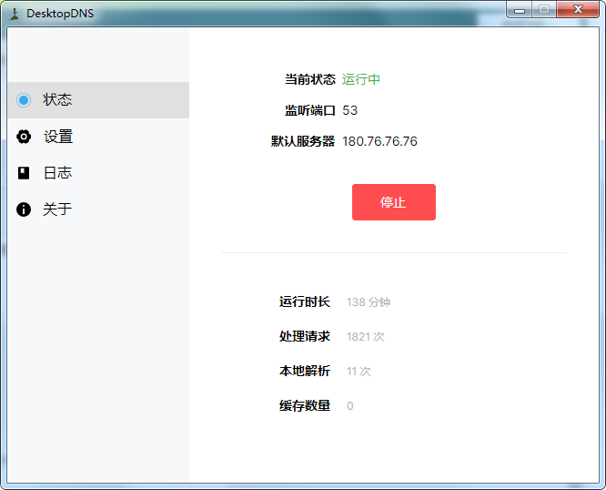
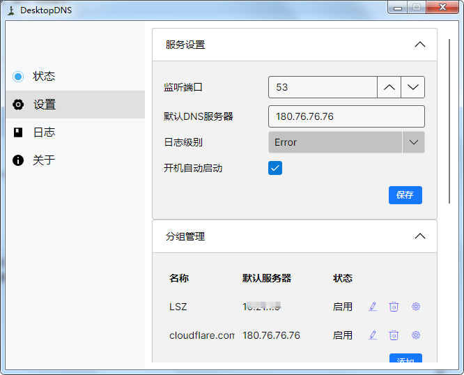
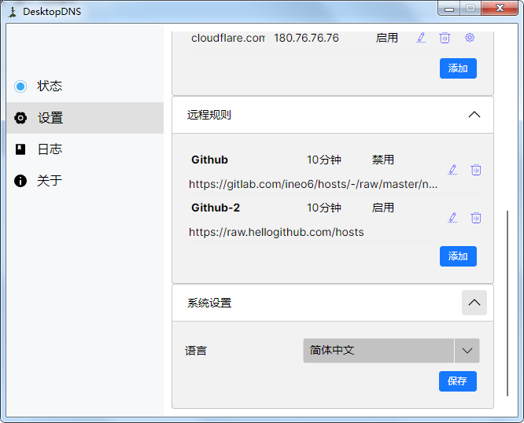
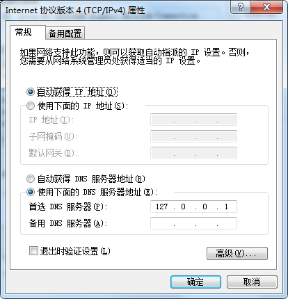

+++
title = 'DesktopDNS，免费小巧桌面型DNS软件'
date = 2026-07-13T06:22:14+08:00
draft = false
cover = './image.png'
slug = 'desktopdns'
keywords =['DesktopDNS', '免费小巧桌面型DNS软件', '跨平台', 'DNS分流','HOSTS替代']
description = 'DesktopDNS是一款免费小巧的桌面型DNS软件，跨平台支持，用于DNS分流，也可用于替代HOSTS切换'
+++
说到DNS，我们一般想到的是向别人提供服务的DNS软件，今天介绍的这个软件是用于自用的桌面型DNS软件，主要是用于替代HOST文件修改，DNS简单分流。

软件共有四个模块：状态、设置、日志、关于。
<!--more-->

# 状态
用于查看和管理软件当前的运行状态和数据。在该模块中，可以对软件的功能进行启停。



# 设置

软件的所有功能设置都在此处完成。

软件的设置分为4个部分：服务设置、分组管理、远程规则和系统设置。





### 服务设置
> 服务设置主要用于在本地开启一个小型DNS服务。
* 监听端口 - 一般填写常规DNS服务的端口，即```53```。
* 默认DNS服务器 - 用于转发DNS的请求，不在我们解析规则中的域名都会被转发到这个DNS服务器。
* 日志级别 - 用于设置在日志模块中显示哪些日志信息。
* 开机自动启动 - 可以设置软件为开机跟随系统一起启动。

### 分组管理
> 用于对不同的域名进行分组解析。
不同的域名可以设置不同的上级DNS服务器，也可设置为本地DNS。域名的匹配支持```正则表达式```、```通配符```、```全相等```等。

> 比如，我可以设置www.baidu.com用180.76.76.76解析，www.taobao.com用223.6.6.6解析，还可以设置www.jd.com直接解析到固定的IP地址（如127.0.0.1）。

### 远程规则
加载远程的DNS解析规则，常用于某些网站的优选IP服务。

### 系统设置
设置软件使用的语言类型。目前支持英文和中文。

# 日志

查看软件运行过程中产生的日志信息。

# 关于

显示软件本身的一些介绍信息。

# 其它说明

### 1. 系统要求

软件可运行于Windows 7/8/10/11，以及Linux(ARM、x64)。
### 2. DNS设置
软件启动后，还有一点需要注意，那就是你电脑的DNS需要设置成你本机的IP，或直接设置为127.0.0.1。



### 3. 特权设置
在Linux下，53端口属于特权端口，需要手动赋予程序```CAP_NET_BIND_SERVICE```能力，参考以下命令：

```shell
sudo setcap 'cap_net_bind_service=+ep' /path/to/your_program
```

# 下载地址

[https://github.com/zsea/DesktopDNS/releases](https://github.com/zsea/DesktopDNS/releases)