+++
title = 'MP4Box安装说明'
date = 2026-09-07T23:25:31+08:00
draft = false
cover = './medown.png'
slug = 'medown-mp4box'
keywords =['米当', 'MP4Box', '视频下载', 'MP4Box安装']
description = 'MP4Box是GPAC 中提供的多媒体打包工具，主要用于处理 ISOBMF 格式的文件（如 MP4、3GP 等）。'
+++

在[**米当**](https://medown.lsz.sc.cn)以前的版本中，使用的是```FFmpeg```做为视频的处理工具，但在实际使用中，经常发生下载的视频出现爆音破音等问题。这是因为米当下载的原始数据格式为```fMP4```，属于MP4的片断，在音轨中，不像普通的格式一样包含了完整的声音频率和采样信息，所以需要更换更为专业的处理工具。

而```MP4Box```则专门用于处理```MP4```格式的视频，能很好的处理下载的原始视频和音频流数据。

在本文中，将详细介绍```MP4Box```的安装与**米当**中的相应配置。

<!--more-->

# 下载

下地网址：[https://gpac.io/downloads/gpac-nightly-builds/](https://gpac.io/downloads/gpac-nightly-builds/)

打开上面的网址，进入软件下载界面。

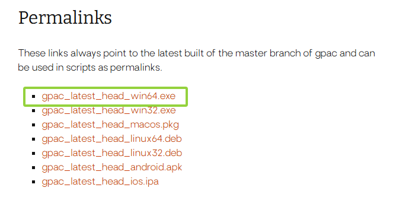

如图中所示，我们选择```gpac_latest_head_win64.exe```。

> 这里列出了多种系统的版本，但我们的**米当**目前仅发布了**Win x64**的版本，这里就仅以64位版本做介绍。

# 安装

找到刚刚下载的软件，如果你没有改文件名的话，那就还是```gpac_latest_head_win64.exe```。

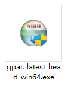

双击它，打开安装程序。

> 如果有```UAC```提示，选择【是】。

然后出现以下界面：

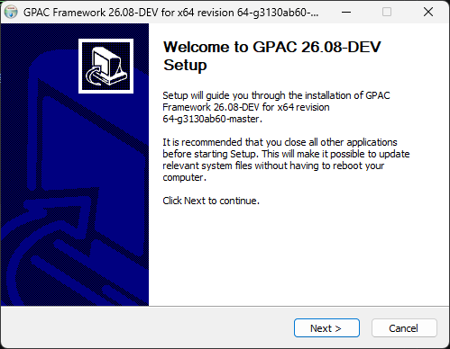

这是一个安装向导的介绍信息，直接点击【next >】进入下一步。

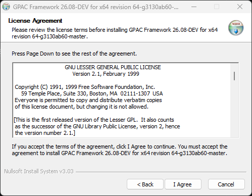

这一步是许可协议，点击【I Agree】进入下一步。

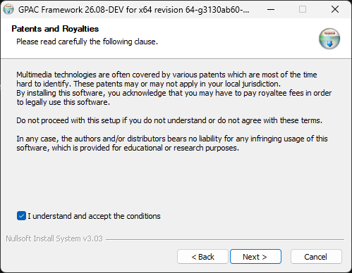

这个界面主要说的是专利与版税的事，像上图一样勾选后点【Next >】进入下一步。

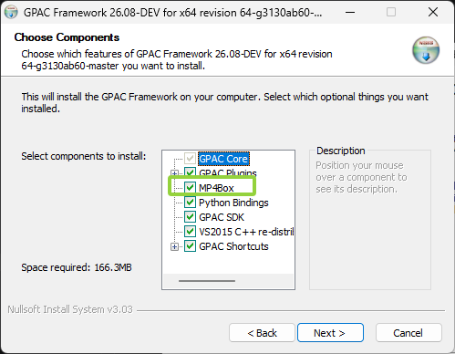

这一步主要选择需要安装的组件，我们主要是使用```MP4Box.exe```，所以图中画框的部分必须要勾选。然后继续点【Next >】进入下一步。

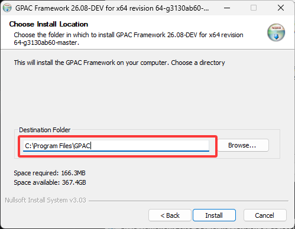

这一步主要选择安装的目录，我们要记好这个目录。点【Install】开始正式安装。

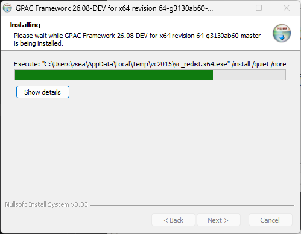

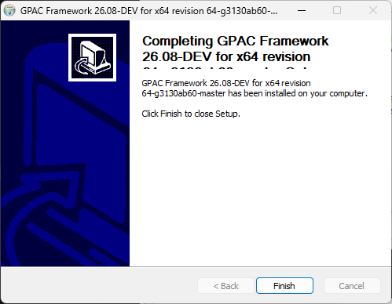

安装完成后，点【Finish】退出安装程序。

## 确认是否安装成功

打开```cmd```命令行窗口，执行以下命令：

```
mp4box -version
```

若出现以下提示，则证明安装成功。

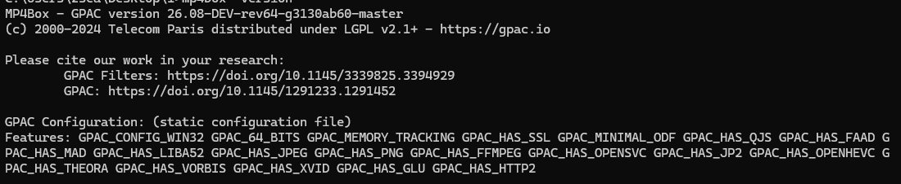

# 在米当中设置

> **米当**中内置了一个轻量的```MP4Box```，但在处理某些大型或特殊网站的文件时，可能会处理得不是特别好，这个时候你可以尝试更换为完全版的```MP4Box```。

> **米当**从1.2.0开始使用```MP4Box```，所以你的软件必须大于或等于1.2.0这个版本。

启动米当，在托盘区右击软图标，选择菜单中的设置，进入设置界面。

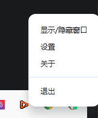

在主要项中，设置```MP4Box```为【本地】，并在后面输入框中选择我们刚才安装的路径下的```mp4box.exe```。

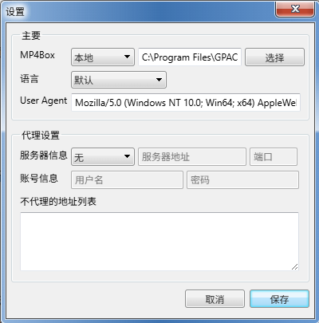

点击【保存】。

# 提示

在正常情况下，你可以直接使用软件内置的```MP4Box```。