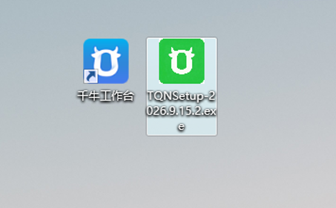
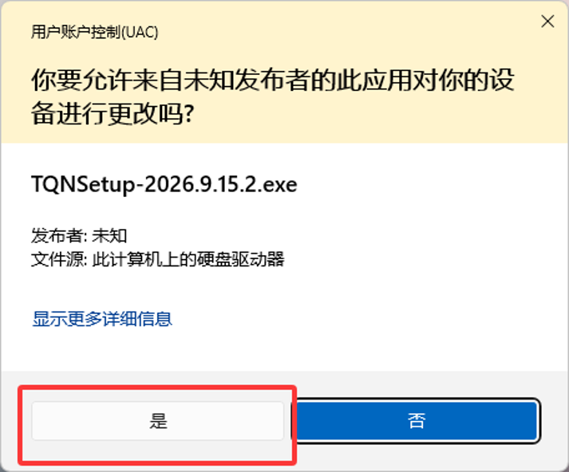
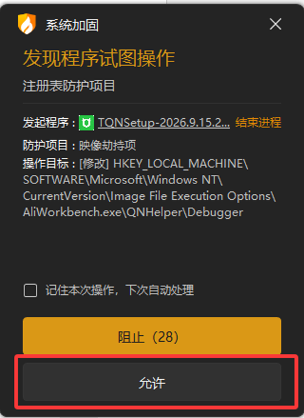
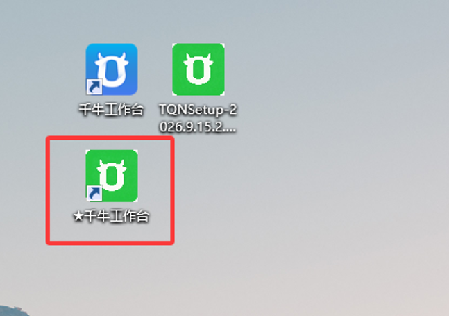
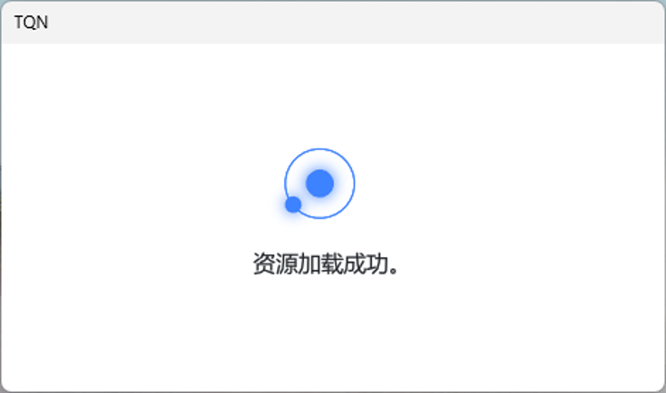
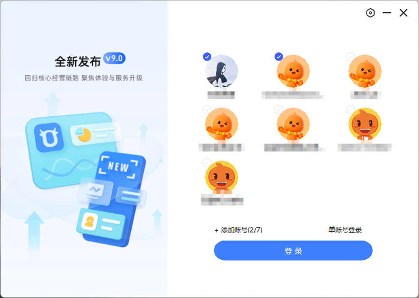
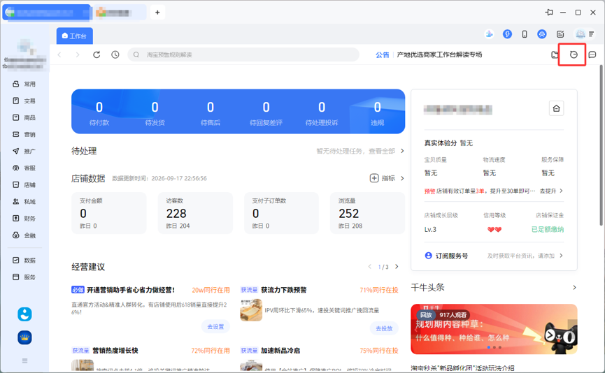
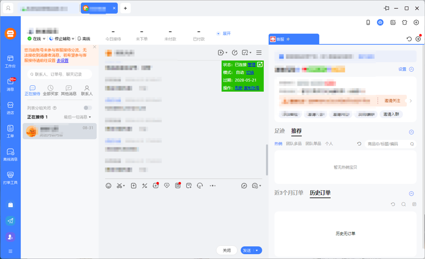
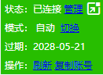

+++
title = '了然客户工具安装使用说明'
date = 2026-09-17T23:06:34+08:00
draft = true
cover ='tqn.ico'
slug = 'tqn-setup'
+++
了然客户工具专注于自动回复，已稳定运行多年。这里，介绍一下最新适配版本的安装与使用。

目前，新版了然客户工具已完成以下版本适配：

* 9.97.59N
* 9.97.70N
* 9.97.74N
* 9.97.80N
* 9.97.81N

最新版下载地址：[http://qianniu.wgkyz.com/TQNSetup-latest.zip](http://qianniu.wgkyz.com/TQNSetup-latest.zip)

<!--more-->

# 安装
当前最新版本为**2026.9.15.2**，下载回来后，安装包图标如下图：

双击安装包，进行安装。

双击后，在弹出的UAC请求界面中选择【是】。

在安装设置界面，有两个选项：

* 工作台位置 - 当前电脑上安装的**工作台**所在的路径，若已安装，安装程序会自动找到，若位置不正确，点击后面的【选择】手动指定路径。
* 安装目录 - 本软件安装到的目录，保持默认即可。

确认设置后，点击【开始安装】。

在安装的过程中，杀毒软件会进行拦截，需点击允许。

安装成功后，会在桌面上生成一个绿色图标的快捷方式。

> 无论是蓝色图标还是绿色图标都可以启动**工作台**软件并加载插件，若前面的杀毒软件没有选择允许，则只有绿色图标启动会加载插件。

软件第一次启动，或**工作台**自动更新后，会从服务器加载资源文件。速度很快，一般就几秒钟。

> 软件稳定运行后，建议参考[https://www.agiso.com/detail/218](https://www.agiso.com/detail/218)设置禁止自动更新。

# 使用

在当前支持的**工作台**版本中，已经可以使用多账号同时登录。

登录成功后，单击右上角的图标，打开所有账号的接待中心。

在接待中心中，需要依次点击所有标签，激活所有账号的插件。

在会话窗口右上角，有绿色的插件控制界面才代表激活成功。

> 插件的设置与原旧版相同。